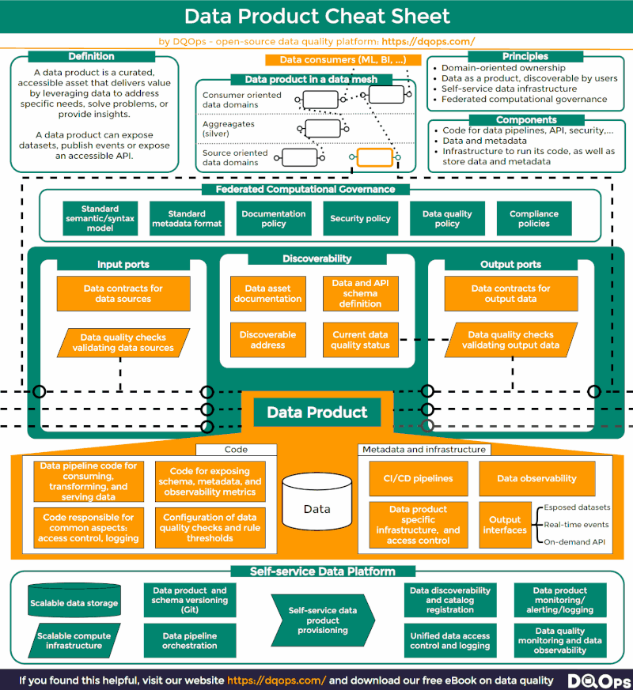

# Management

* [Avito Manifesto](https://manifesto.avito.com/)
* [Zvuk Teamlead Meetup](https://m.vkvideo.ru/video-227426787_456239045?list=ln-jWOKL2vKdG7qqEAiJy)
* [How to Build a Successful Tech Team](https://www.youtube.com/watch?v=M2bb3nM6vsY)

# Common engineering

* [YOUTUBE: Всё что надо знать про сети](https://youtu.be/a55ecIWIkVc?si=W279Sa5tTgXjiTSQ)
* [Modern Hardware Numbers for System Design](https://hellointerview.substack.com/p/modern-hardware-numbers-for-system)
* [Building Event-Driven Backend Systems with FastAPI + Kafka](https://medium.com/algomart/building-event-driven-backend-systems-with-fastapi-kafka-4d1dde287cc1)
* [30-blogs-to-learn-30-system-design-concepts](https://www.linkedin.com/posts/ashishps1_30-blogs-to-learn-30-system-design-concepts-activity-7424305668846899200-lj8d)
* [repo](https://github.com/conduktor/kafka-beginners-course)
*[konductor site](https://www.conduktor.io/apache-kafka-for-beginners/) + [aws course](https://www.udemy.com/course/apache-kafka/learn/lecture/11566824#overview)
* [kafka](https://habr.com/ru/articles/880700/)
* [Kafka consumer group](https://levelup.gitconnected.com/a-gentle-introduction-to-kafka-consumer-group-530d3a3286dd)
* [kafka](https://www.linkedin.com/feed/update/activity:7232050163211464704)
* [Engineering blog posts](https://www.linkedin.com/feed/update/activity:7106915969129721857)
* [MLEM](https://mlem.ai/doc)
* [python packaging](https://www.linkedin.com/posts/maria-vechtomova_python-softwareengineering-machinelearning-activity-7245681523478138880-zNT5?utm_source=share&utm_medium=member_ios)
* [SOLID pricipies](https://medium.com/webbdev/solid-4ffc018077da)
* [Python ML SOLID](https://towardsdatascience.com/scale-your-machine-learning-projects-with-solid-principles-824230fa8ba1)
* [SOLID](https://www.linkedin.com/feed/update/activity:7307324823112749056)
* [When O(n) faster then O(nLog(n))](https://www.linkedin.com/posts/activity-7416183170779590656-FjG1)
* [AI development cursor](https://www.linkedin.com/learning/create-your-dream-apps-with-cursor-and-claude-ai/ai-web-development-with-cursor)
* [spec driven development](https://github.com/fall-out-bug/sdp)
* [How to build with Nano Banana](https://dev.to/googleai/how-to-build-with-nano-banana-complete-developer-tutorial-646)
* [10-common-software-architectural-patterns](https://towardsdatascience.com/10-common-software-architectural-patterns-in-a-nutshell-a0b47a1e9013)
* [design patterns for microservices](https://www.linkedin.com/posts/adnan-maqbool-khan-0b4531a1_%F0%9D%90%8F%F0%9D%90%9A%F0%9D%90%AD%F0%9D%90%AD%F0%9D%90%9E%F0%9D%90%AB%F0%9D%90%A7%F0%9D%90%AC-%F0%9D%90%9F%F0%9D%90%A8%F0%9D%90%AB-%F0%9D%90%8C%F0%9D%90%A2%F0%9D%90%9C%F0%9D%90%AB%F0%9D%90%A8%F0%9D%90%AC%F0%9D%90%9E%F0%9D%90%AB%F0%9D%90%AF%F0%9D%90%A2%F0%9D%90%9C%F0%9D%90%9E%F0%9D%90%AC-activity-7332649473191337984-JXJK)
* [software design principes](https://www.linkedin.com/posts/milanmilanovic_%F0%9D%97%A0%F0%9D%97%AE%F0%9D%97%B6%F0%9D%97%BB-%F0%9D%97%A6%F0%9D%97%BC%F0%9D%97%B3%F0%9D%98%81%F0%9D%98%84%F0%9D%97%AE%F0%9D%97%BF%F0%9D%97%B2-%F0%9D%97%97%F0%9D%97%B2%F0%9D%98%80%F0%9D%97%B6%F0%9D%97%B4%F0%9D%97%BB-%F0%9D%97%A3-activity-7285200291237388288-0ckw)
* [API architectural patterns](https://blog.levelupcoding.com/p/luc-60-unpacking-leading-api-architectural-styles)
* [CAP theorem explained](https://blog.algomaster.io/p/cap-theorem-explained)
* [design-patterns-with-python-for-machine-learning-engineers-builder](https://towardsdatascience.com/design-patterns-with-python-for-machine-learning-engineers-builder-45b8e749f134)
* [Kubernetes](https://youtu.be/V2gxVJgHq4M?si=6T5twuQMfhhpVjhR)
* [Kubernetes cheatsheet](https://www.linkedin.com/posts/pau-labarta-bajo-4432074b_crash-course-on-%F0%9D%97%9E%F0%9D%98%82%F0%9D%97%AF%F0%9D%97%B2%F0%9D%97%BF%F0%9D%97%BB%F0%9D%97%B2%F0%9D%98%81%F0%9D%97%B2%F0%9D%98%80-for-activity-7326878675268743168-s3z2)
* [Kubernetes learning path](https://www.linkedin.com/posts/pau-labarta-bajo-4432074b_github-astral-shuv-an-extremely-fast-activity-7323254881060872193-jMtd)
* [Learning Kubernetes](/861c9675652040f8b1fb79caf053be96?pvs=25)
* [design-patterns-for-microservices-activity](https://www.linkedin.com/posts/martinroberts_design-patterns-for-microservices-activity-7117803993770184704-au_8)
* [system-design-for-discovery](https://eugeneyan.com/writing/system-design-for-discovery/)
* [design likes count](https://www.linkedin.com/posts/kanat-zhussipov_%D1%81%D1%87%D0%B5%D1%82%D1%87%D0%B8%D0%BA-%D0%BB%D0%B0%D0%B9%D0%BA%D0%BE%D0%B2-%D0%B2-%D0%BF%D0%BE%D1%81%D1%82%D0%B5-ugcPost-7428182003725914113-n_kI)
* [machine-learning-systems-design](https://huyenchip.com/machine-learning-systems-design/toc.html)
* [system design handbook](https://www.linkedin.com/feed/update/ugcPost:7104063099728478208)
* [ByteByteGo engineering](https://www.youtube.com/@ByteByteGo/featured)
* [HTTP and REST API’s](https://blog.bytebytego.com/p/the-foundation-of-rest-api-http)
* [SOAP vs REST vs GraphQL vs RPC](https://www.linkedin.com/feed/update/activity:7214515536263536640)
* [System design BluePrint](https://blog.devgenius.io/system-design-blueprint-the-ultimate-guide-e27b914bf8f1)
* [SystemDesign Template](https://www.linkedin.com/posts/arslanahmad_systemdesign-interviews-microservices-activity-7024703661683482624-Hu3D?utm_source=share&utm_medium=member_desktop)
* [top 10 architectural patterns](https://www.linkedin.com/posts/milanmilanovic_softwarearchitecture-programming-coding-activity-7320333125849440257-ExnA)
* [software architecture patterns](https://www.linkedin.com/posts/tarasowski_7-software-architecture-patterns-every-engineer-activity-7320099000748019713-svnQ)
* [system-design-interview-survival-guide-2023-preparation-strategies-and-practical-tips](https://levelup.gitconnected.com/system-design-interview-survival-guide-2023-preparation-strategies-and-practical-tips-ba9314e6b9e3)
* [Newssellers list](https://www.linkedin.com/feed/update/activity:7107631743829983232/?trk=feed_main-feed-card_comment-cta)
* [System design interview blogpost [Patrick Halina]](http://patrickhalina.com/posts/ml-systems-design-interview-guide/)
* [16 System Design Concepts](https://www.linkedin.com/feed/update/activity:7048606546414485504)
* [9 design patterns in machine learning systems](https://www.linkedin.com/feed/update/activity:7056786461387345921?trk=feed_main-feed-card_social-actions-comments)
* [Design patterns cheatsheet](https://www.linkedin.com/feed/update/activity:7050063494766813184/)
* [Model Registry](https://www.linkedin.com/feed/update/activity:7030585879362506752/)
* [Model monitoring: data drift](https://towardsdatascience.com/monitoring-machine-learning-models-in-production-why-and-how-13d07a5ff0c6)
* [Designing Netflix](https://www.linkedin.com/feed/update/urn:li:activity:7055780065044803584)
* [Rate limiter](https://habr.com/ru/articles/448438/)
* [7 algorithms for system design interview](https://www.linkedin.com/posts/arslanahmad_%3F-%3F%3F%3F%3F%3F%3F%3F%3F%3F%3F-%3F%3F-%3F%3F%3F%3F-%3F%3F%3F%3F%3F%3F-activity-7062766715868246016-gmQk?utm_source=share&utm_medium=member_desktop)
* [how-we-built-the-tinder-api-gateway](https://medium.com/tinder/how-we-built-the-tinder-api-gateway-831c6ca5ceca)
* [using-streaming-ingestion-with-amazon-sagemaker-feature-store-to-make-ml-backed-decisions-in-near-real-time](https://aws.amazon.com/ru/blogs/machine-learning/using-streaming-ingestion-with-amazon-sagemaker-feature-store-to-make-ml-backed-decisions-in-near-real-time/)
* [AWS engineer certification](https://medium.com/@collin-smith/passing-the-aws-machine-learning-specialty-certification-in-2024-adcf358c29b3)
* [Dockerfiles](https://medium.com/@akhilesh-mishra/you-should-stop-writing-dockerfiles-today-do-this-instead-3cd8a44cb8b0)
* [Naoma](https://www.naoma.ai/) 
* [Lightdash](https://www.lightdash.com/)
* [JIT](https://pytorch.org/docs/stable/jit.html)
* [YOUTUBE JWT, Bearer, Access, Refresh](https://youtu.be/qsdJeix2MlY?feature=shared)

# Data engineering

* [Spark interview question](https://www.linkedin.com/posts/venkateshh-chitteti-50b62316b_spark-interview-questions-activity-7088115892747735040-R0dl)
* [100 devops questions](https://www.linkedin.com/feed/update/ugcPost:7078869453626568705)
* [Spark joins](https://bigdataschool.ru/blog/join-operations-in-spark-sql.html)
* [flipkart-data-engineer-interview](https://medium.com/nerd-for-tech/flipkart-data-engineer-interview-3c62bc19d37b)
* [DevOps exercises](https://github.com/bregman-arie/devops-exercises)
* [building-an-open-source-mixpanel-alternative](https://cube.dev/blog/building-an-open-source-mixpanel-alternative-1)
* [selfservice dasboard](https://briefer.cloud/blog/posts/self-serve-bi-myth/)
* [opensource-tableau](https://github.com/Kanaries/graphic-walker?utm_campaign=Data_Elixir&utm_source=Data_Elixir_420#readme)
* [OpenTelemetry](https://opentelemetry.io/)
* [python-one-billion-row-challenge-from-10-minutes-to-4-seconds](https://towardsdatascience.com/python-one-billion-row-challenge-from-10-minutes-to-4-seconds-0718662b303e)
* [my-first-billion-of-rows-in-duckdb](https://towardsdatascience.com/my-first-billion-of-rows-in-duckdb-11873e5edbb5)
* [building-a-data-streaming-pipeline-leveraging-kafka-spark-airflow](https://medium.com/@simardeep.oberoi/building-a-data-streaming-pipeline-leveraging-kafka-spark-airflow-and-docker-16527f9e9142)
* [ClickHouse or StarRocks? Here is a DETAILED Comparison](https://medium.com/@wangtianyi_86442/clickhouse-or-starrocks-here-is-a-detailed-comparison-c743a0b7b95f)
* [dbt + Airflow = ❤️ | Making Plum](https://medium.com/plum-fintech/dbt-airflow-50b2c93f91cc)
* [Best Data Observability tools 2024: RANKED](https://medium.com/@hugolu87/best-data-observability-tools-2024-ranked-52f51f880da9)
* [Simplify Airflow DAG Creation and Maintenance with Hamilton in 8 minutes](https://towardsdatascience.com/simplify-airflow-dag-creation-and-maintenance-with-hamilton-in-8-minutes-e6e48c9c2cb0)
* [JupyterLab user guide - Amazon SageMaker AI](https://docs.aws.amazon.com/sagemaker/latest/dg/studio-updated-jl-user-guide.html)
* [Migrating Your Existing ELT Data Pipeline to PyAirbyte](https://airbyte.com/blog/migrating-your-elt-data-pipeline-to-pyairbyte)
* [How to sync JSON file to PostgreSQL destination](https://airbyte.com/how-to-sync/json-file-to-postgresql-destination)
* [Medalion architecture](https://www.linkedin.com/feed/update/activity:7253334134612262912/)
* [Data catalog: от истории до сравнения решений / Хабр](https://habr.com/ru/companies/vk/articles/857894/)
* [Why you should avoid partitioning by date in S3 and use ISO 8601 instead](https://www.linkedin.com/posts/luminousmen_dataengineering-share-7381395454598623235-VVAS)

## DLT
* [Dagster University](https://courses.dagster.io/)
* [DLT fundamentals](https://github.com/dlt-hub/dlthub-education/tree/main/courses/dlt_fundamentals_dec_2024)
* [DLT fundamentals](https://colab.research.google.com/drive/1laas5XkGEQIqmpFX48pIL48-OoV_mEye#scrollTo=kWlIz6xAIfZM)
* [DLT fundamentals](https://colab.research.google.com/drive/108ULdgkN7K3nu3W2b1e7UJiFXFMPHmlG?usp=sharing#scrollTo=4k356aKzxhjS)
* [Pipeline tutorial | dlt Docs](https://dlthub.com/docs/build-a-pipeline-tutorial)
* [Cloud storage and filesystem | dlt Docs](https://dlthub.com/docs/dlt-ecosystem/verified-sources/filesystem)
* [Dagster & dlt (Component) | Dagster Docs](https://docs.dagster.io/integrations/embedded-elt/dlt)
* [Orchestrating unstructured data pipeline with Dagster and dlt](https://dlthub.com/blog/dlt-dagster)
* [Incremental loading | dlt Docs](https://dlthub.com/docs/general-usage/incremental-loading)
* [Cloud storage and filesystem | dlt Docs](https://dlthub.com/docs/dlt-ecosystem/verified-sources/filesystem#create-your-own-pipeline)
* [Postgres | dlt Docs](https://dlthub.com/docs/dlt-ecosystem/destinations/postgres)
* [Load from Postgres to Postgres faster | dlt Docs](https://dlthub.com/docs/examples/postgres_to_postgres)
* [30+ SQL databases (powered by SQLAlchemy) | dlt Docs](https://dlthub.com/docs/dlt-ecosystem/destinations/sqlalchemy)
* [How do I ingest data into my data warehouse (like Snowflake) on my own? · dagster-io/dagster · Discussion #16570 · GitHub](https://github.com/dagster-io/dagster/discussions/16570)
* [Blog | dlt Docs](https://dlthub.com/blog)
* [DLT is Great!](https://medium.com/@jordipuig37/dlt-is-great-f90fea847e52)
* [dlt schema evolution](https://colab.research.google.com/drive/1rA2qQYRM05jCa3N_C-mxmAsd2Sl2o1EQ?usp=sharing)
* [Tutorial: Build an ETL pipeline using change data capture - Azure Databricks | Microsoft Learn](https://learn.microsoft.com/en-us/azure/databricks/delta-live-tables/tutorial-pipelines)
* [Dagster & dlt (Component) | Dagster Docs](https://docs.dagster.io/integrations/embedded-elt/dlt)
* [The art of data orchestration using Dagster](https://medium.com/@rsmahajan511/the-art-of-data-orchestration-using-dagster-8cc0fbd660de)
* [GitHub - dlt-hub/dlt-dagster-demo: dlt-dagster-demo](https://github.com/dlt-hub/dlt-dagster-demo)
* [Harness builds an end to end data platform](https://dlthub.com/blog/harness-full)
* [Colab: dlt schema evolution](https://colab.research.google.com/drive/1rA2qQYRM05jCa3N_C-mxmAsd2Sl2o1EQ?usp=sharing)
* [dlt vs airbyte](https://www.reddit.com/r/dataengineering/s/qgMWvlKaMK)
* [Google Forms to Notion (Broken Link) | dlt Blog](https://dlthub.com/devel/blog/google-forms-to-notion)
* [Build an Email Reporting Pipeline | Dagster Blog](https://dagster.io/blog/outbound-reporting-pipeline)
* [Mastering Real-Time Data Pipelines: Implementing CDC with Strimzi Kafka Connect from PostgreSQL to MinIO — Part-1](https://ibrahimhkoyuncu.medium.com/mastering-real-time-data-pipelines-implementing-cdc-with-strimzi-kafka-connect-from-postgresql-to-8476ad62d5d8)
* [how-ngrok-uses-dagster-to-run-our-data-platform](https://ngrok.com/blog-post/how-ngrok-uses-dagster-to-run-our-data-platform)
* [practical-dbt-flatten-json-with-dbt](https://medium.com/@redbetelgeuse/practical-dbt-flatten-json-with-dbt-c24a2ee67fbf)
* [Dbt as a data platform core](https://youtu.be/u8LkCBVKKus?si=k3lc443_tY-QQ0pq)
* [dbt for testing](https://www.linkedin.com/posts/oleg-agapov_how-we-test-our-dbt-project-testing-modeling-activity-7330979140138926081-p6bZ)
* [how-to-scrape-data-from-a-website](https://airbyte.com/data-engineering-resources/how-to-scrape-data-from-a-website)
* [chat-with-your-confluence-using-airbyte](https://www.pondhouse-data.com/blog/chat-with-your-confluence-using-airbyte)
* [building-a-simple-data-pipeline-using-pyairbyte](https://medium.com/@mani.bellan/building-a-simple-data-pipeline-using-pyairbyte-baa1fb06c111)
* [PyAirbyte](https://airbytehq.github.io/PyAirbyte/airbyte.html)
* [airbyte integrations](https://docs.airbyte.com/integrations/sources/file)
* [airbyte connectors](https://airbyte.com/connectors/json-file)
* [text-as-data-from-anywhere-to-anywhere](https://zilliz.com/blog/text-as-data-from-anywhere-to-anywhere)
* [Dragonfly: A High-Performance In-Memory Data Store for Distributed Systems](https://medium.com/geekculture/dragonfly-a-high-performance-in-memory-data-store-for-distributed-systems-248edc02b0c6)
* [How Discord Stores Trillions of Messages](https://levelup.gitconnected.com/how-discord-stores-trillions-of-messages-curious-case-of-system-design-b6328f387196)
* [Uber data culture](https://eng.uber.com/ubers-journey-toward-better-data-culture-from-first-principles/)
* [VK: build data platform](https://www.youtube.com/watch?v=1m9qqa9jGGE)
* [data engineering cheetsheet](https://blog.surfalytics.com/p/ultimate-cheatsheet-for-data-engineering)
* [Elastic](https://www.elastic.co/training/free)
* [ускорение Elastic](https://habr.com/ru/companies/sbermegamarket/articles/688216/)
* [JunoDB](https://github.com/paypal/junodb)
* [Pandas, Polars, DuckDB](https://youtu.be/vy8VrhaYR2M?si=q8JKykrqipxDa9qE)
* [CDC (change data capture)](https://www.linkedin.com/feed/update/urn:li:activity:7089161742642999297)
* [Protobuf vs Avro](https://softwaremill.com/data-serialization-tools-comparison-avro-vs-protobuf/)

### Dagster

* [using-duckdb-with-dagster](https://docs.dagster.io/integrations/duckdb/using-duckdb-with-dagster)
* [anatomy-of-a-data-platform-how-to-choose-your-data-architecture](https://medium.com/@lou_adam/anatomy-of-a-data-platform-how-to-choose-your-data-architecture-bc36472e7783)
* [courses](https://courses.dagster.io/)
* [getting-started/quickstart](https://docs.dagster.io/getting-started/quickstart)
* [youtube: Dagster course](http://youtube.com/@dagsterio/videos)
* [Data drift](https://www.linkedin.com/feed/update/activity:7254815279011008515)
* [build-an-interface-to-your-data-platform](https://medium.com/conveyordata/build-an-interface-to-your-data-platform-f1927c33c5ad)
* [semantic layer](https://www.linkedin.com/feed/update/activity:7237119503854092289)
* [semantic layer](https://medium.com/wrenai/why-the-semantic-layer-is-essential-for-reliable-text-to-sql-and-how-wren-ai-brings-it-to-life-c54cc0e6e4bc)
* [Analytics engineer interview](https://www.linkedin.com/posts/oleg-agapov_want-to-ace-your-analytics-engineering-interview-activity-7332786354155622400-M4IA)
* [data contract](https://medium.com/@mcgeehan/how-i-learned-to-stop-worrying-and-love-the-data-contract-c72f197c6f30)
* [data contract](https://www.linkedin.com/feed/update/activity:7178653307610030080)
* [data modeling](https://pragmaticdataorg.wordpress.com/blog-posts/)
* [data-modeling-101-06-identity-keys-and-storing-history](https://pragmaticdataorg.wordpress.com/2025/05/26/data-modeling-101-06-identity-keys-and-storing-history/#types-of-keys)
* [dataquality-datagovernance-dataengineering](https://www.linkedin.com/posts/piotr-czarnas_dataquality-datagovernance-dataengineering-activity-7321975497297416193-3JNQ/)
* [data quality](https://www.linkedin.com/posts/dlthub_dataengineering-dataquality-python-activity-7416127590303911936-cbuN)
* [Data engineering basics](https://www.linkedin.com/posts/sspaeti_books-people-blogs-activity-7321133780230959104-WbJF)
* [data engineering interview questions](https://www.youtube.com/watch?v=sqLCAjc9DYQ)

### DLT hub

* [dlthub-and-pinecone](https://sketchmyview.medium.com/how-i-used-rag-aws-bedrock-dlthub-and-pinecone-to-explore-uk-property-data-f2490643959d)
* [dlt summarization pipeline](https://www.linkedin.com/posts/lancedb_dlt-summarization-reddit-activity-7280621372853133312-_m0z)
* [Data Engineering with Python and AI](https://github.com/dlt-hub/dlthub-education/tree/main/courses/freecodecamp/de_with_dlt_2025)
* [Data Engineering for ETL: Data Ingestion with dlt](https://colab.research.google.com/drive/1-wMCZFb-9W9G_-welq-TrizPH2XzsgQi#scrollTo=mtzlNoq-tsNx&forceEdit=true&sandboxMode=true)
* [YOUTUBE] [Data engineering for LLMs with Python](https://www.youtube.com/watch?v=T23Bs75F7ZQ)
* [Data Engineering for ETL: Data Ingestion with dlt](https://colab.research.google.com/drive/1nQt6G6gNyIlJuKi_X-RMwbUyYDdkPI9k#forceEdit=true&sandboxMode=true)
* [data contracts](https://youtu.be/-n3OD-ml_k0?si=aeiQz95gmiTqLXC8)
* [enhancing-text-to-sql-with-a-fine-tuned-7b-llm-for-database-interactions](https://yia333.medium.com/enhancing-text-to-sql-with-a-fine-tuned-7b-llm-for-database-interactions-fa754dc2e992)
* [how-not-to-partition-data-in-s3-and-what-to-do-instead](https://luminousmen.com/post/how-not-to-partition-data-in-s3-and-what-to-do-instead) 
* [real-life-advice-on-building](https://thedataecosystem.substack.com/p/issue-36-real-life-advice-on-building) 
* [Iceberg explained](https://jack-vanlightly.com/blog/2024/8/7/table-format-comparisons-how-do-the-table-formats-represent-the-canonical-set-of-files)
* [Data validation using pytest](https://towardsdatascience.com/mlops-data-validation-with-pytest-749641874871/)
* [Spark optimization Course](https://medium.com/@kevinchwong/intensive-spark-optimization-course-082bdd0592bc)
* [GCP data platform](https://www.linkedin.com/posts/eduardoalmazang_i-built-a-pipeline-from-scratch-combining-activity-7346449107902738433-W9gW/)
* [TractoAI: better data infra](https://tracto.ai/blog/better-data-infra)

### Dashboards

* [analytics-stack](https://modal.com/blog/analytics-stack)
* [dashboards](https://docs.lightdash.com/get-started/exploring-data/dashboards)
* [plot-data-from-csv](https://plotly.com/python/plot-data-from-csv/)
* [Yandex GeoCoder](https://habr.com/ru/companies/yandex/articles/877086/)
* [funnel dashboard](https://www.linkedin.com/posts/eugenia-shtanova_finally-the-complete-e-commerce-funnel-ugcPost-7283063048108474368-yTQ6)
* [Metabase](https://medium.com/@_michaellin/i-sold-a-software-business-for-20-000-on-acquire-com-heres-what-i-learned-ac600c2a248f + https://app.acquire.com/all-listing)
* [LightDash](https://docs.lightdash.com/self-host/self-host-lightdash-docker-compose)
* [LightDash](https://docs.lightdash.com/get-started/exploring-data/dashboards)
* [LightDash](https://docs.lightdash.com/self-host/customize-deployment/use-sso-login-for-self-hosted-lightdash)
* [AWS data engineering](https://www.linkedin.com/posts/sachincw_aws-data-engineering-notes2pdf-activity-7329807969318039553-Kcdx)
* [supabase](https://supabase.com/blog/supabase-logs-self-hosted)
* [Text to sql for code](https://medium.aiplanet.com/understanding-and-querying-code-a-rag-powered-approach-b85cf6f30d11)
* [dagster](https://github.com/dagster-io/dagster)
* [awesome-pipeline](https://github.com/pditommaso/awesome-pipeline?tab=readme-ov-file)
* [DAG: hamilton](https://towardsdatascience.com/functions-dags-introducing-hamilton-a-microframework-for-dataframe-generation-more-8e34b84efc1d)
* [loading data](https://hamilton.dagworks.io/en/latest/concepts/best-practices/loading-data/)
* [hamilton](https://github.com/DAGWorks-Inc/hamilton/tree/main/examples/prefect)
* [lineage-hamilton](https://towardsdatascience.com/lineage-hamilton-in-10-minutes-c2b8a944e2e6)
* [data engineering vault](https://www.ssp.sh/brain/data-engineering/?trk=feed_main-feed-card-text)

# Pet projects

* [PetProject monitoring](https://habr.com/ru/companies/ozontech/articles/572150/)
* [Parse NGINX access logs](https://linuxhint.com/parse-nginx-access-logs/)
* [how-i-built-an-nlp-based-recommendation-system-in-24-hours](https://maniii.medium.com/how-i-built-an-nlp-based-recommendation-system-in-24-hours-84dffd0df398)
* [building-a-startup-from-scratch-my-mistakes-as-cto](https://medium.com/@egor-romanov/building-a-startup-from-scratch-my-mistakes-as-cto-b20b463e0058)
* [nk-systemdesign-one_how-id-scale-a-site-to-1-million-usersstep-activity](https://www.linkedin.com/posts/nk-systemdesign-one_how-id-scale-a-site-to-1-million-usersstep-activity-7329471582936969218-RyJq)
* [ML algorithms](https://www.smashingmagazine.com/2023/08/friction-feature-machine-learning-algorithms/)
* [Public API](https://github.com/public-apis/public-apis#music)
* [10 Exciting Project Ideas Using Large Language Models (LLMs) for Your Portfolio](https://towardsdatascience.com/10-exciting-project-ideas-using-large-language-models-llms-for-your-portfolio-970b7ab4cf9e#a45e)

# Startups

Credits program

* [foundershub.startups.microsoft.com](https://foundershub.startups.microsoft.com/?trk=public_post_comment-text)
* [aws.amazon.com](https://aws.amazon.com/startups?lang=en-US&trk=public_post_comment-text)
* [startup.google.com](https://startup.google.com/cloud/#next-step?trk=public_post_comment-text)
* [Startup-CTO-Handbook](https://github.com/ZachGoldberg/Startup-CTO-Handbook)
* [medium.com](https://medium.com/@_michaellin/i-sold-a-software-business-for-20-000-on-acquire-com-heres-what-i-learned-ac600c2a248f)
* [linkedin.com](https://www.linkedin.com/posts/agostino-calamia_ai-machinelearning-productmanagement-activity-7310616548296056833-4619)
* [dataproducts.substack.com](https://dataproducts.substack.com/p/the-shift-left-data-manifesto)
* [linkedin.com](https://www.linkedin.com/posts/madhav-mistry-999349164_fullstackmarketer-marketing-seo-activity-7310634523195506688-yJAm)
* [medium.com](https://medium.com/@dswharshit/what-you-should-build-with-ai-analyzing-400-ai-startups-backed-by-ycombinator-9782237755f3)
* [Big AI overview](https://docs.google.com/presentation/d/1rFQ0hPyYja3HKRdGEgjeDxr0MSE8wiQ2iu4mDtwR6fc/mobilepresent?slide=id.g2a10a510c4b_0_151)
* [marketing strategy](https://www.linkedin.com/posts/nekrasovdy_everyone-wants-to-grow-ltv-almost-no-one-activity-7335974574708146179-IjiR)
* [UI for engineers](https://uxdesign.cc/designing-for-ai-engineers-what-ui-patterns-and-principles-you-need-to-know-8b16a5b62a61)
* [Еще один фреймворк: как мы стали пилить интеграции за спринт вместо квартала](https://youtu.be/Q_bhGSLfShM?si=2I0EM5QMLIElBF0g)

# Coding

## Go

* [Часть 1](https://medium.com/@mhrlife/building-an-online-taxi-app-like-uber-with-golang-part-1-nearby-taxis-c509168ef59f)
* [Часть 2](https://medium.com/@mhrlife/building-an-online-taxi-app-like-uber-with-golang-part-2-scalability-and-authorization-4583d51f22a3)
* [Часть 3](https://medium.com/@mhrlife/building-an-online-taxi-app-like-uber-with-golang-part-3-redis-to-rescue-ab579cfdd299)
* [Часть 4](https://medium.com/@mhrlife/building-an-online-taxi-app-like-uber-with-golang-part-4-why-golang-1cd70d416417)
* [codecademy.com](https://www.codecademy.com/courses/learn-go/lessons/learn-go-introduction/exercises/from-the-get-go)
* [15 ways learn GO](https://www.linkedin.com/feed/update/urn:li:activity:7077616398876700672)

# Kotlin
* [Kotlin academy](https://www.jetbrains.com/pages/academy/kotlin/)
