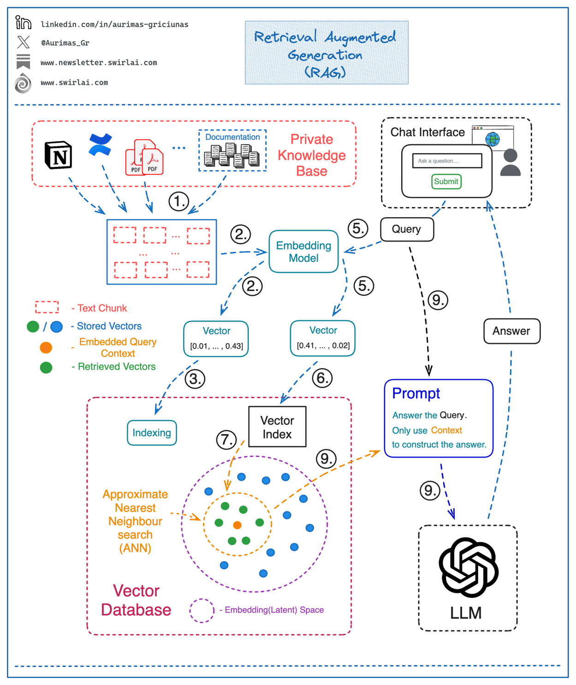

# RAG

* [RAG with Weaviate and LLaMAIndex](https://lightning.ai/weaviate/studios/chat-with-your-code-rag-with-weaviate-and-llamaindex)
* [Azure AI Studio prompt flow](https://learn.microsoft.com/en-us/azure/ai-studio/how-to/prompt-flow)
* [Advanced RAG pipeline](https://learn.deeplearning.ai/courses/building-evaluating-advanced-rag/lesson/2/advanced-rag-pipeline)
* [Local RAG](https://medium.com/@vndee.huynh/build-your-own-rag-and-run-it-locally-langchain-ollama-streamlit-181d42805895)
* [RAG with Weaviate and LLaMAIndex](https://www.linkedin.com/feed/update/activity:7293939519232368640)
* [Knowledge Graphs for RAG course](https://learn.deeplearning.ai/courses/knowledge-graphs-rag/lesson/1/introduction)
* [Graph RAG: langchain + neo4j](https://medium.com/@valentinaalto/introducing-graphrag-with-https://medium.com/@valentinaalto/introducing-graphrag-with-langchain-and-neo4j-90446df17c1e-90446df17c1e)
* [NVIDIA: RAG with LLaMA2](https://courses.nvidia.com/courses/course-v1:NVIDIA+S-FX-16+v1/)
* [RAG: Gemma7B + FAISS (kaggle notebook)](https://www.kaggle.com/code/youssef19/building-rag-using-gemma-faiss-vector-db)
* [RAG chatbot Gemma2B](https://medium.com/towards-data-science/how-to-build-a-local-open-source-llm-chatbot-with-rag-f01f73e2a131)
* [integrating-vector-databases-with-llms-a-hands-on-guide](https://medium.com/@mlengineering/integrating-vector-databases-with-llms-a-hands-on-guide-82d2463114fb)
* [Weaviate RAG](https://www.youtube.com/watch?v=IiNDCPwmqF8&ab_channel=Weaviate%E2%80%A2VectorDatabase)
* [RAG LLAMA index](https://medium.com/dphi-tech/advanced-rag-using-llama-index-e06b00dc0ed8)
* [Open source RAG tools](https://medium.com/programmers-journey/three-open-source-rag-tools-you-need-to-know-about-331c3f28ab22)
* [RAG langchain](https://medium.com/@thakermadhav/build-your-own-rag-with-mistral-7b-and-langchain-97d0c92fa146)
* [RAG techiques](https://www.linkedin.com/feed/update/ugcPost:7166691825880174592)
* [RAG intelligent agent](https://medium.com/data-science-at-microsoft/forget-rag-embrace-agent-design-for-a-more-intelligent-grounded-chatgpt-6c562d903c61)
* [RAG LLaMA factory](https://www.linkedin.com/feed/update/activity:7177129541763563521)
* [RAG fine tuning](https://www.linkedin.com/feed/update/activity:7177221504454004736)
* [Cohere embeddings for RAG](https://txt.cohere.com/embed-compression-embedjobs/)
* [NVIDIA RAG](https://courses.nvidia.com/courses/course-v1:NVIDIA+S-FX-16+v1/course/)
* [RAG roadmap learning](https://github.com/aishwaryanr/awesome-generative-ai-guide/blob/main/resources/RAG_roadmap.md)
* [RAG weavite + LLaMAIndex](https://lightning.ai/weaviate/studios/chat-with-your-code-rag-with-weaviate-and-llamaindex)
* [a-practitioners-guide-to-retrieval-augmented-generation-rag](https://towardsdatascience.com/a-practitioners-guide-to-retrieval-augmented-generation-rag-36fd38786a84)
* [how-to-build-a-rag-system-with-a-self-querying-retriever-in-langchain](https://towardsdatascience.com/how-to-build-a-rag-system-with-a-self-querying-retriever-in-langchain-16b4fa23e9ad)
* [From Local to Global: A Graph RAG Approach to Query-Focused Summarization](https://arxiv.org/abs/2404.16130v1)
* [TabR: RAG for table data](https://artgor.medium.com/paper-review-tabr-unlocking-the-power-of-retrieval-augmented-tabular-deep-learning-ab85137958b9)
* [ColiVara multimodal RAG](https://www.linkedin.com/feed/update/activity:7309862835067502592)
* [LLAMA index: agentic reasoning system for search](https://www.linkedin.com/feed/update/activity:7306845599796973568)
*[RAG techniques](https://github.com/NirDiamant/RAG_Techniques)
* [graphrag-amazon-bedrock](https://aws.amazon.com/ru/blogs/database/using-knowledge-graphs-to-build-graphrag-applications-with-amazon-bedrock-and-amazon-neptune/)
* [graphrag-with-neo4j-and-langchain-constructing-the-graph](https://medium.com/neo4j/implementing-from-local-to-global-graphrag-with-neo4j-and-langchain-constructing-the-graph-73924cc5bab4)
* [neo4j graph RAG](https://www.linkedin.com/feed/update/urn:li:activity:7229542287062491137/)
* [LLAMA correctic RAG](https://www.linkedin.com/feed/update/activity:7306845599796973568)
* [langchain-graph-rag](https://pub.towardsai.net/langchain-graph-rag-gpt-4o-python-project-easy-ai-chat-for-your-website-46a46e24f161)
* [llamaindex-rag](https://medium.com/datadriveninvestor/build-knowledge-graph-rag-with-llamaindex-from-pdf-documents-99ccef833840)
* [graph rag](https://medium.com/singapore-gds/from-conventional-rag-to-graph-rag-a0202a1aaca7)
* [Large Dual Encoders Are Generalizable Retrievers](https://preview.aclanthology.org/emnlp-22-ingestion/2022.emnlp-main.669.pdf) + [Exploring Google’s T5 Text-To-Text Transformer Model](https://wandb.ai/mukilan/T5_transformer/reports/Exploring-Google-s-T5-Text-To-Text-Transformer-Model--VmlldzoyNjkzOTE2)
* [Graph RAG](https://neo4j.com/developer-blog/global-graphrag-neo4j-langchain/)
* [GraphRag langgraph langchain](https://medium.com/neo4j/implementing-from-local-to-global-graphrag-with-neo4j-and-langchain-constructing-the-graph-73924cc5bab4)
* [short-courses/knowledge-graphs-rag](https://www.deeplearning.ai/short-courses/knowledge-graphs-rag)
* [using-redis-for-real-time-rag-goes-beyond-a-vector-database](https://redis.io/blog/using-redis-for-real-time-rag-goes-beyond-a-vector-database/)
* [Open RAG](https://openrag.notion.site/Open-RAG-c41b2a4dcdea4527a7c1cd998e763595?pvs=21)
* [LLM-RAG](https://medium.com/@petrpan/llm-101-build-your-own-book-reading-bot-or-search-engine-with-llm-rag-21823684dfb2#603f)
* [RAG best practices](https://medium.com/@zilliz_learn/build-ai-apps-with-retrieval-augmented-generation-rag-c2e4ed8ada1d)
* [Advanced RAG implementation](https://medium.aiplanet.com/advanced-rag-implementation-on-custom-data-using-hybrid-search-embed-caching-and-mistral-ai-ce78fdae4ef6)
* [RAG base](https://medium.com/towards-data-science/a-guide-on-12-tuning-strategies-for-production-ready-rag-applications-7ca646833439)
* [OpenAI retrieval plugin](https://github.com/openai/chatgpt-retrieval-plugin) based on [GPT-Index](https://pypi.org/project/gpt-index/) + [GitHub demo](https://llamahub.ai/l/chatgpt_plugin) + [LinkedIn tutorial](https://www.linkedin.com/pulse/extending-chatgpt-knowledge-base-custom-datasources-cezar-romaniuc)
* [improving-RAG-systems-dhs2024](https://github.com/dipanjanS/improving-RAG-systems-dhs2024)