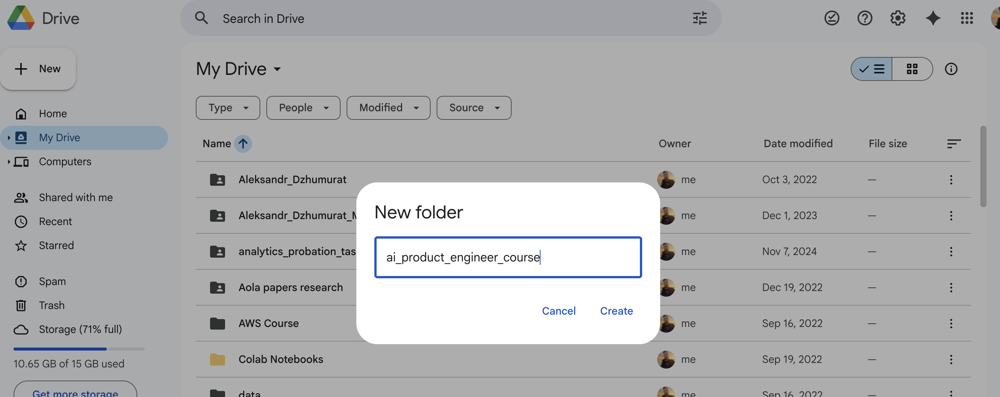
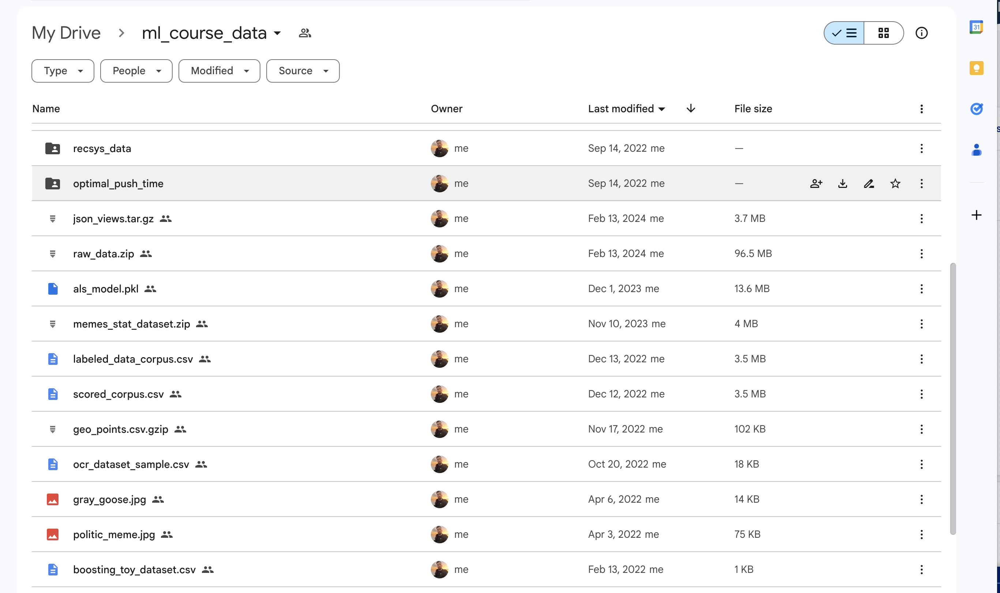
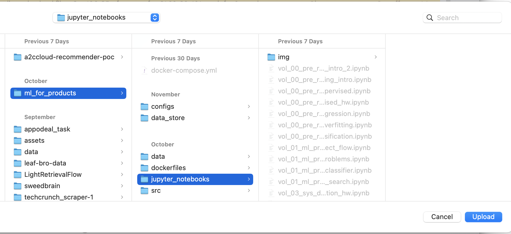
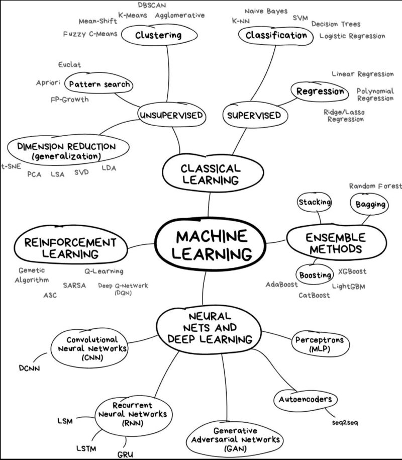

[](http://www.youtube.com/watch?v=yFGYz8XAw30 "Лекция 04 vol 1: Организация кода в ML проектах")

start with [installing uv](https://docs.astral.sh/uv/getting-started/installation/)

How to code using agents: [learn cursor](https://cursor.com/learn)

## Keys generation

key generation
```shell
ssh-keygen -o  -t ed25519 -f ~/.ssh/meaningful_key_name -C "your_terminal_name"
```

Access restrictions
```shell
chmod 600 ~/.ssh/meaningful_key_name
```

Downloading repo if restricted
```shell
GIT_SSH_COMMAND="ssh -i ~/.ssh/meaningful_key_name" git clone ssh://git@gitlab.pvt:442/gapa/recsys/recsys_app.git
```

OR modify ssh config `nano ~/.ssh/config`

```shell
Host gitlab.YOURCOMPANY.com
    HostName gitlab.YOURCOMPANY.com
    User git
    IdentityFile ~/.ssh/your_key_name
    IdentitiesOnly yes
    
Host github-personal
    HostName github.com
    User git
    IdentityFile ~/.ssh/id_ed25519
    IdentitiesOnly yes
```


## Creating python environment 
 
```shell
uv venv --python 3.13;
source .venv/bin/activate;
uv pip install -r requirements.txt
```

### Old way: pyenv 
Install deps

```bash
brew install openssl xz gdbm
```

Install python versions

```
pyenv install 3.12 && \
pyenv virtualenv 3.12 mlproducts-env \
source ~/.pyenv/versions/mlproducts-env/bin/activate
```

Install requirements

```shell
python3 -m pip install -r requirements.txt
```

Set up `.vscode/settings.json`

```json
{
    "python.envFile": "${workspaceFolder}/.env",
    "terminal.integrated.env.osx": {
        "PYTHONPATH": "${workspaceFolder}/src"
    },
    "python.analysis.extraPaths": [
        "${workspaceFolder}/src"
    ],
    "editor.formatOnSave": true,
}
```

run jupyter

```shell
make run-jupyter
```

or use direct command

```shell
jupyter notebook jupyter_notebooks --ip 0.0.0.0 --port 8887 \
	--NotebookApp.token='' --NotebookApp.password='' --allow-root --no-browser 
```

# Data preparation


Go to [google drive](https://drive.google.com/drive/my-drive) and create directory ai_product_engineer_course 



Step 1: download data to the local machine or copy to our google drive: [ML for products](https://drive.google.com/drive/folders/1FMLKfNZZyFgzOhWjOiyeN3XvCsjT5-ET?usp=drive_link)



Upload jupyter_notebooks from your local machine to google drive. It is just an option, for sure you can run all jupyter code on local machine



Also upload an src dir to Google Drive.

Open first notebook [vol_00_pre_requirements_01_machine_learning_intro.ipynb](../jupyter_notebooks/vol_00_pre_requirements_01_machine_learning_intro.ipynb) and enjoy!

## Local option

Докер для винды (обе опции) https://docs.docker.com/desktop/setup/install/windows-install/

Подробнее про WSL: https://learn.microsoft.com/en-us/windows/wsl/install

## Remote option

edit `~/.ssh/config`

```python
Host remote_dev
    HostName 168.119.168.170    
    User root    
    Port 22
    IdentityFile ~/.ssh/id_rsa
```

**Connect in VSCode**

- Click the green icon in the bottom-left corner
- Select "Connect to Host..."
- Choose "myserver" from the list

Install [SFTP extension](https://marketplace.visualstudio.com/items?itemName=Natizyskunk.sftp)

Install https://code.visualstudio.com/docs/devcontainers/create-dev-container

Configure with .devcontainr/devcontainer.json

```jsx
{
    "image": "python3.12",
    "runArgs": [
        "--network=host",
    ],    
    "customizations":{
        "vscode": {
            "extensions":[
                "ms-python.python",
                "ms-python.vscode-pylance"
            ],
            "settings": {
                "python.defaultInterpreterPath": "/srv/bin/python3"
            }
        }
    }
}
```

For extension search `Ctrl`+`Shift`+`P`

Плюс действительно интересная опция с Cloud.ru https://cloud.ru/ - есть возможность  Удаленно подключиться к убунте и настроить докер по инструкции для убунты

Интересная ссылка: [Google collab remote](https://www.linkedin.com/posts/jeremy-arancio_struggling-with-running-llms-for-your-experimentations-activity-7376201218483863552-XIQw)

[Add ssh key to remote machine](https://community.hetzner.com/tutorials/add-ssh-key-to-your-hetzner-cloud)

# Подробнее о курсе



# Цели курса

Курс построен таким образом чтобы дать максимально широкое понимание темы “Запуск ML продукта” с глубоким пониманием каждого отдельного этапа

- Business understanding
- Exploratory data analysis
- Experiment planning
- MVP and prepare service for deploy

# Программа курса

Будет шесть занятий (с лабораторными), в каждой из которых разберём одну тему из области ML и один прикладной инструмент

Тема [инструмент]

- [Жизненный цикл ML проекта](https://youtu.be/Fl440k56_yY?si=TKItDIXkxahIB1x2): как собрать идеальную команду [Google Colab]
- [Применение NLP в ML](https://youtu.be/ahKsCZBTOfM?si=d5VAaeeHMhtS4mQm) [Label Studio]
- [Многорукие бандиты](https://youtu.be/3jurSlIe2Q8?si=BKfPlgMis6G77ZTg) как пример realtime ML [FastAPI].
- [Обучение без учителя](https://youtu.be/TT5Kd1Zmwpo?si=WDn0QKIH3yLhNH8m): кластеризация, снижение размерности [Streamlit]
- [Рекомендательные системы](https://youtu.be/fEbwRMnviqA?si=qfvkCXBQYbSjm8oW)
- [ML system design](https://youtu.be/h5pPNDz-qUQ?si=QyMHhqB_ymwRKWmq)

Чего не будет в курсе

- глубокого погпужения в нейросети не будет
- devops часть трогать не будем

# Курсовой проект

Для курсового проекта нужно выбрать и реализовать в составе команды ML проект. Идеал - команда из трех специалистов

- Аналитик
- Data Scientist
- ML engineer

В качестве источника данных выбираем [Delivery Hero Recommendation Dataset](https://dl.acm.org/doi/pdf/10.1145/3604915.3610242)

**Важно:** данныe [доступны в Google Drive](https://github.com/deliveryhero/dh-reco-dataset)

Темы курсовых проектов представлены ниже (нужно выбрать одну тему на команду)

Курсовой проект должен состоять из трех частей

- EDA (jupyter notebook) - делает Data аналитик
- Модель - делает Data Scientist на основании
- Интерфейс (Streamlit, либо React) - делает ML инженер

## Рекомендательная система

- [Прогноз корзины](https://youtu.be/872uZTqY85k?si=pGfQaKTrsM9XflZE)
- Рекомендация нового ресторана для пользователя
- [Товары-заменители](https://youtu.be/tbTekebpK6E?si=iYBMOsgBryCcsZUd)
- Блок “С этим товаром покупают”
- [Алгоритм DPP](https://github.com/laming-chen/fast-map-dpp/blob/master/dpp.py): добавить в рекомендательный сервис механизмы разнообразия

## Контентные сервисы

- [Категоризация товаров](https://www.youtube.com/watch?v=38P2RIkHolQ&t=1240s): прогноз кухни для продукта
- Составление рациона на день
- Автокомплит поисковой строки
- кросс-рекомендации ресторанов между городами

## Оптимизация маркетплейса

- Модель ценности заказа для курьера (какой заказ выбрать по расстоянию и цене)
- [Прогнозирование спроса в районе](https://youtu.be/YnsJ4l0Z3o8?si=_jp3JkGEgZjUrvUS)
- [Cимуляция города](https://youtu.be/F_bN3CuRPU8?si=TKbazVflyi7ED_R4)
- Поиск локации локации для ресторана


# VSCode

- [GitHub's git cheatsheet](https://education.github.com/git-cheat-sheet-education.pdf)
- [GitLab's git cheatsheet](https://about.gitlab.com/images/press/git-cheat-sheet.pdf)
- [learnggitbranching.js.org](learnggitbranching.js.org)
- [14-vs-code-extensions-every-data-engineer-should-swear-by-for-maximum-productivity](https://medium.com/@manojkumar.vadivel/14-vs-code-extensions-every-data-engineer-should-swear-by-for-maximum-productivity-9fcc2e1b3c4f)
- [clickhouse-support](https://marketplace.visualstudio.com/items?itemName=LinJun.clickhouse-support)
- [python-software-development-course](https://github.com/phitoduck/python-software-development-course)
- [clean-code-python](https://testdriven.io/blog/clean-code-python/)
- [refactoring](https://martinfowler.com/books/refactoring.html)
- [ohmyzsh](https://github.com/ohmyzsh/ohmyzsh/wiki/Installing-ZSH)
- [zsh-autosuggestions](https://github.com/zsh-users/zsh-autosuggestions/blob/master/INSTALL.md#oh-my-zsh)
- [zsh-syntax-highlighting](https://github.com/zsh-users/zsh-syntax-highlighting/blob/master/INSTALL.md)
- [ohmyz.sh](https://ohmyz.sh/#install)
- [Taking Python to Production: A Professional Onboarding Guide](https://www.notion.so/Taking-Python-to-Production-A-Professional-Onboarding-Guide-799409731bf14c78a531ac779f1bd76d?pvs=21) 
- [keyboard-shortcuts-macos](https://code.visualstudio.com/shortcuts/keyboard-shortcuts-macos.pdf)
- [keyboard-shortcuts-linux](https://code.visualstudio.com/shortcuts/keyboard-shortcuts-linux.pdf)