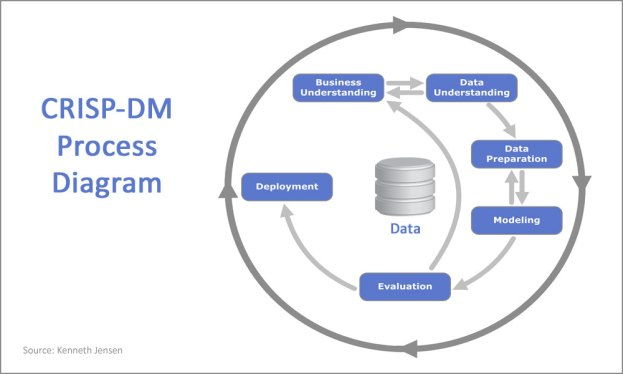
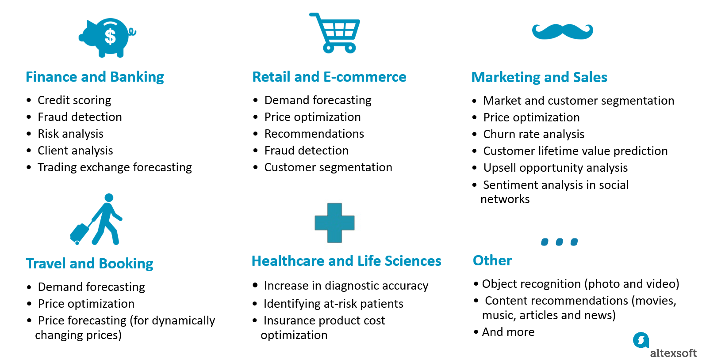
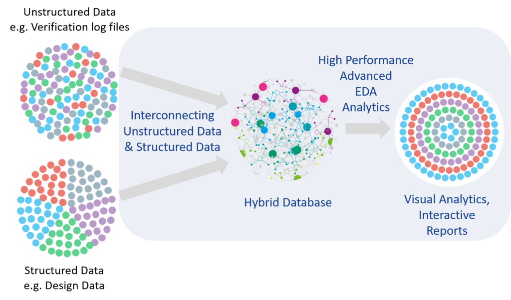
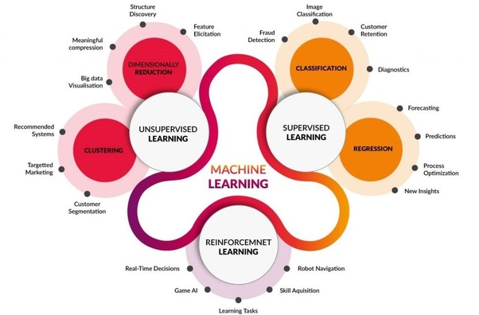

# ML проeкт: основные этапы

[Jupyter notebook](https://github.com/aleksandr-dzhumurat/ai_product_engineer/blob/main/jupyter_notebooks/vol_01_ml_products_01_ML_project_flow.ipynb)

Вопросы для самопроверки

* Перечислите основные этапы ML проекта и коротко опишите каждый этап
* Перечислите известные вам алгоритмы классификации. Какие достоинства и недостатки у каждого из них?
* Назовите основные метрики классификации. Что такое ROC-AUC?
* Boosting vs Bagging: краткое описание и основные различия
* Продвинутые тeхники построения моделей: stacking, blending.

# Жизненный цикл ML проекта

Мы познакомились с машинным обучением на примере алгоритма регрессии.

В бизнесе моделирование - это только маленькая часть проекта по машинному обучению, который состоит из нескольких этапов. Эти этапы описаны в стандарте CRISP-DM

## Что такое CRISP-DM

[CRISP-DM](https://ru.wikipedia.org/wiki/CRISP-DM) (Cross-Industry Standard Process for Data Mining) - это методология развития  проектов с машинным обучением, основные шаги которой представлены на диаграмме

## Выявление бизнес-требований

Самый важный этап - понимание потребностей бизнеса

## Подготовка данных

Разбиваем на два этапа:

* Обзор доступных данных (data undestanding): EDA (Exploratory data analysis)
* Преобразования и структурирование данных (data_preparation): ETL (Extract, transformation, load)

## Обучение модели

тут снова два этапа

* обучение (Modeling)
* оценка качества (Evaluation)

# Виды ML задач

Алгоритмы машинного обучения можно разделить на несколько больших групп

Для наглядности к каждому типу задач ML приведены бизнес-задачи, который алгоритмы этого семейства решают

## Применение модели

Выкатывание в продакшн (deployment) - последний этап.

На этом этапе поделие выпускается "в свет": начинаем мониторить онлайн-метрики

## Итоги занятия

* ML проекты рождаются, растут и выкатываются в прод
* плохо прошёл хотя бы один из этапов - весь проект завалится, потому что они связаны

## Обучение с учителем (supervised learning)

Нужна размеченная выборка

### Классификация (classification)

Метки дискретные (называются классами)

### Регрессия (regression)

Метки непрерывные

## Обучение без учителя (unsupervised learning)

Размечать выборку не нужно

### Кластеризация (clustering)

Разделить объекты на группы таким образом чтобы разные объекты попали в разные группы, близкие объекты - в одну.

### Снижение размерности (dimension reduction)

снизить количество фичей

## Обучение с подкреплением (reinforcement learning)

Обучающей выборки не существует. Алгоритм является агентом, который взаимодействует со средой. Если взаимодействие успешное, агент получает вознаграждение, а если неуспешное то штраф.