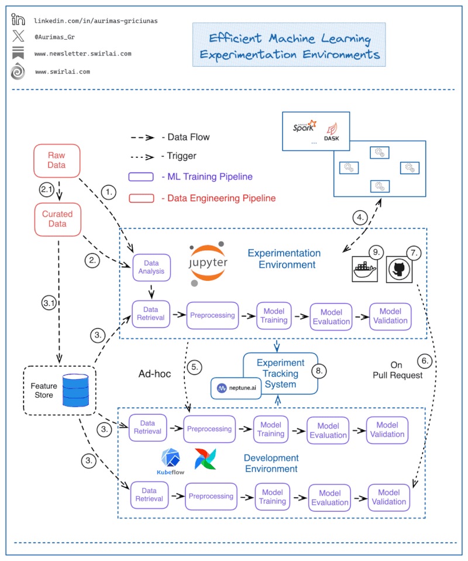

# Введение в MLOps



References
* [genai-platform](https://huyenchip.com/2024/07/25/genai-platform.html)
* [ml system design](https://www.linkedin.com/feed/update/activity:7274347641138728961)
* [MLOps maturity model](https://www.linkedin.com/feed/update/activity:7229381328490622976)

## Шаг 1: среда разработки

Скачать дамп [messages.db](https://drive.google.com/file/d/1Ej6pV_GAXFDGxMk45Dntn2pnSlnn6IRs/view?usp=sharing) и положить в директорию [data](./data)

Запустить сборку докер-контейнера для разработки

```shell
make build
```

## Шаг 2

Этап EDA (Exploratory Data Analysis) - запускаем Jupyter чтобы "покопаться" в данных

```shell
make notebook
```

Открываем браузер по ссылке [localhost:8888](http://localhost:8888/)

После EDA сохраняем файл [scored_corpus.csv](https://drive.google.com/file/d/1lRpQOCwxwt0JAU9wDUOvhJ3CaYZMYFO_/view?usp=share_link) в директорию `data` (либо можно скачать из google drive по ссылке)

## Шаг 3: Разворачиваем LabelStudio

На этом шаге нужно разметить выборку в LabelStudio. Запускаем интерфейс командой

```shell
make labelstudio
```

Далее

* на вкладке `Sign up` вводим любой логин и пароль
* создаём проект и загружаем датасет на вкладке **Data import**
* 
* на вкладке `Labeling`  `Ordered By Time`
* Label all tasks
* размечаем на positive/negative
* когда датасет размечен - нажимаем "export"

Сохраняем размеченный датасет в файл `labeled_messages.csv`

# Шаг 5: Эксплуатация модели

Скачиваем размеченный датасет [по ссылке](https://drive.google.com/file/d/1MrxsEbeeJnIMdjL_GjsYysdKADyF5EQo/view?usp=sharing)

добавляем модель с микросервис

* [__main__](../src/train.py) - обучить модель с качеством f1 больше 0.86106
    *  Bert для фичей
    * более сложная модель (бустинг?)
* [pridict_labell](../src/service.py) - загрузить модель в сервис и реализовать API
    * `feed`
    * `/messages/<string:identifier>'`
* прислать PR в репозиторий

# Experimentation environment

What does an 𝗘𝗳𝗳𝗲𝗰𝘁𝗶𝘃𝗲 𝗠𝗮𝗰𝗵𝗶𝗻𝗲 𝗟𝗲𝗮𝗿𝗻𝗶𝗻𝗴 𝗘𝘅𝗽𝗲𝗿𝗶𝗺𝗲𝗻𝘁𝗮𝘁𝗶𝗼𝗻 𝗘𝗻𝘃𝗶𝗿𝗼𝗻𝗺𝗲𝗻𝘁 look like?

MLOps practices are there to improve Machine Learning Product development velocity, the biggest bottlenecks happen when Experimentation Environments and other infrastructure elements are integrated poorly.

Let’s look into the properties that an effective Experimentation Environment should have. As a MLOps engineer you should strive to provide these to your users and as a Data Scientist, you should know what you should be demanding for.

𝟭: Access to the raw data. While handling raw data is the responsibility of Data Engineering function, Data Scientists need the ability to explore and analyze available raw data and decide which of it needs to be moved upstream the Data Value Chain (2.1).

𝟮: Access to the curated data. Curated data might be available in the Data Warehouse but not exposed via a Feature Store. Such Data should not be exposed for model training in production environments. Data Scientists need the ability to explore curated data and see what needs to be pushed downstream (3.1).

𝟯: Data used for training of Machine Learning models should be sourced from a Feature Store if the ML Training pipeline is ready to be moved to the production stage.

𝟰: Data Scientists should be able to easily spin up different types of compute clusters - might it be Spark, Dask or any other technology - to allow effective Raw and Curated Data exploration.

𝟱: Data Scientists should be able to spin up a production like remote Machine Learning Training pipeline in development environment ad-hoc from the Notebook, this increases speed of iteration significantly.

𝟲: There should be an automated setup in place that would perform the testing and promotion to a higher env when a specific set of Pull Requests are created. E.g. a PR from feature/* to release/* branch could trigger a CI/CD process to test and deploy the ML Pipeline to a pre-prod environment.

𝟳: Notebooks and any additional boilerplate code for CI/CD should be part of your Git integration. Make it crystal clear where a certain type of code should live - a popular way to do this is providing repository templates with clear documentation.

𝟴: Experiment/Model Tracking System should be exposed to both local and remote pipelines.

𝟗: Notebooks have to be running in the same environment that your production code will run in. Incompatible dependencies should not cause problems when porting applications to production. It can be achieved by running Notebooks in containers.

# References

