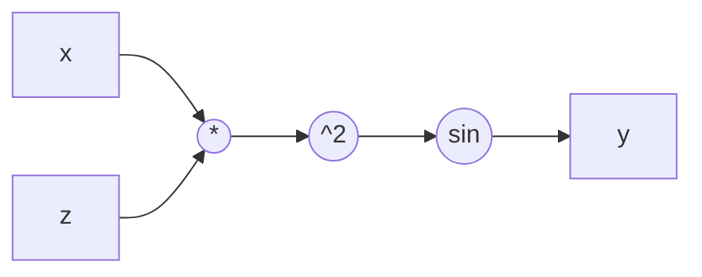

# Basics

Нейросеть — это функция с миллионами параметров, которая отображает вход в выход. Параметры подбираются так, чтобы минимизировать ошибку на обучающих данных.

Code examples

* [Binary classification with PyTorch](https://shivambaldha.medium.com/binary-classification-with-pytorch-85089b284940)
* [Deep Learning with PyTorch](https://github.com/rasbt/deeplearning-models)
* [PyTorch: rewind all](https://colab.research.google.com/drive/1p1aAaauy_LZlZ5ZKLvwc6cdYkVhbZ-8B?usp=sharing)
* [PyTorchUltimateMaterial](https://github.com/DataScienceHamburg/PyTorchUltimateMaterial)

# Perceptron explained

Один нейрон (перцептрон)

```
x₁ ─┐
x₂ ─┤─ Σ(wᵢxᵢ + b) → f(z) → выход
x₃ ─┘
```

- $w$ — веса (что важно)
- $b$ — смещение (bias)
- $f$ — функция активации (нелинейность)

Без нелинейных функций активации сеть из любого числа слоёв — это просто линейное преобразование.

---

## Прямой проход (Forward pass)

```python
# Один слой
z = W @ x + b       # линейная комбинация
a = relu(z)          # активация
```

Данные проходят слой за слоем: вход → скрытые слои → выход.

Функции активации

| Функция | Формула | Где |
|---------|---------|-----|
| ReLU | $\max(0, x)$ | скрытые слои |
| Sigmoid | $\frac{1}{1+e^{-x}}$ | бинарная классификация |
| Softmax | $\frac{e^{x_i}}{\sum_j e^{x_j}}$ | многоклассовая классификация |
| GELU | $x \cdot \Phi(x)$ | трансформеры |
| Tanh | $\frac{e^x - e^{-x}}{e^x + e^{-x}}$ | RNN |

---

## Обратное распространение (Backpropagation)

1. Считаем ошибку (loss) на выходе — например, CrossEntropy (y — истинные метки, $\hat{y}$ — предсказания модели)

   $$L = -\sum \left[ y \cdot \log(\hat{y}) + (1 - y) \cdot \log(1 - \hat{y}) \right]$$

2. Берём производную loss по каждому параметру ($W, b$) через chain rule
3. Обновляем параметры ($W, b$) в сторону уменьшения loss

Chain rule:

$$\frac{\partial L}{\partial w} = \frac{\partial L}{\partial a} \cdot \frac{\partial a}{\partial z} \cdot \frac{\partial z}{\partial w}$$

**Example**
 
$$
f(x, z) = \sin(x \cdot z)^2
$$

Render in mermaid diagram


 
Partial derivatives (chain rule)
 
$$
\frac{\partial f}{\partial x} = \cos\!\left((x \cdot z)^2\right) \cdot 2(x \cdot z) \cdot z
$$
 
$$
\frac{\partial f}{\partial z} = \cos\!\left((x \cdot z)^2\right) \cdot 2(x \cdot z) \cdot x
$$
 
Numerical evaluation at $x = 1,\ z = 2$
 
$$
\left.\frac{\partial f}{\partial x}\right|_{x=1,\, z=2}
= \cos(4) \cdot 2(1 \cdot 2) \cdot 2
= 8\cos 4
\approx -5.23
$$

Шаг градиентного спуска:

$$W \gets W - \eta \frac{\partial L}{\partial W}$$
$$b \gets b - \eta \frac{\partial L}{\partial b}$$

где $\frac{\partial L}{\partial W}, \frac{\partial L}{\partial b}$ — градиенты

Проблемы:
- Затухающий градиент — в глубоких сетях градиент умножается много раз и стремится к 0. Решение: ReLU, batch norm, residual connections.
- Взрывной градиент — Градиенты очень большие, веса обновляются слишком сильно → обучение нестабильно.

Opetimization method - способ обновления весов (градиентный спуск и разные его вариации: adam, etc).

Epoch: перемешиваем датасет и разбиваем на батчи. Далее считаем градиенты по батчам и обновляем веса, каждая эпоха - это один проход по всему датасету.

Momentum helps gradient descent move in a smoother, more consistent direction by remembering where it was going before.

AdaGrad adapts the learning rate for each parameter individually, increasing it for infrequent features and decreasing it for frequent ones.

Adam combines the benefits of both momentum and AdaGrad, making it a popular choice for deep learning.

Это похоже на методы второго порядка, когда используем не только направление но и кривизну.

DNN проблемы:

* Not enough data
* not enough features or features not expressive
* model too simple


# Exploding/Vanishing Gradients


## Vanishing gradients (затухающие градиенты)

Если градиенты слишком большие или маленькие → обучение нарушается

- Backpropagation updates weights using the chain rule, multiplying gradients at each layer.
- If the activation function (e.g., sigmoid, tanh) produces values in (0,1), their derivatives are also small.
- Multiplying small numbers repeatedly shrinks gradients exponentially → layers at the beginning get close to zero updates.

Результат:

- Потеря способности сети обучать нижние слои
- Очень медленная сходимость
- "застреваем" в неоптимальном минимуме

Причины

Малые веса + сигмоидная/tanh активация:

$$\sigma'(x) = \sigma(x)(1-\sigma(x)) \le 0.25$$

Множитель < 1 на каждом слое → градиент быстро стремится к 0

## Exploding gradients (взрывающиеся градиенты)

Что происходит

Градиенты очень большие, веса обновляются слишком сильно → обучение нестабильно

Причины
- Большие начальные веса
- Длинная сеть → многократное умножение больших матриц
- Некорректная активация (ReLU с большим входом)

Симптомы
- Loss becomes NaN or infinity.
- Веса резко прыгают - обучение никогда не сойдется


## Как бороться

Для vanishing gradients

Использовать "хорошие" активации
- ReLU, LeakyReLU, GELU → градиенты не затухают

Инициализация весов
- Xavier/Glorot, He

Нормализация
- BatchNorm → стабилизирует распределение. Нормализует активации внутри батча → ускоряет обучение, снижает зависимость от инициализации.

Нормализация:

$$\hat{x} = \frac{x - \mu}{\sigma}$$

Масштабирование и сдвиг:

$$y = \gamma \cdot \hat{x} + \beta$$

где $\gamma$ и $\beta$ — обучаемые параметры.

Shortcut/Residual connections: ResNet → позволяет градиенту "протекать" через сеть

Для exploding gradients

Gradient clipping
```python
torch.nn.utils.clip_grad_norm_(model.parameters(), max_norm=1.0)
```

Меньший learning rate

Хорошая инициализация

Использовать нормализацию
- BatchNorm, LayerNorm

Вывод

| Проблема | Симптом | Решение |
|----------|---------|---------|
| Vanishing | Градиенты близки к 0, ранние слои не учатся | ReLU, BatchNorm, Residual, Xavier/He |
| Exploding | Градиенты огромные, loss → NaN | Gradient clipping, уменьшить LR, нормализация |

## Saddles, Flat Regions & Poor Optimization

Even if vanishing/exploding gradients don’t occur, gradients can still be problematic in saddle points or plateaus.

What Happens?

- Saddle Points: Points where gradients are close to zero but are not local minima (some dimensions have increasing loss, others decreasing).
- Flat Regions: Areas where gradients vanish temporarily, slowing learning drastically (e.g., bad weight initialization).

Solutions

- Use adaptive optimizers (Adam, RMSProp) to navigate flat areas faster.
- Use momentum-based optimizers (SGD with momentum, Nesterov) to escape saddle points.
- Try learning rate schedules (cosine annealing, warm restarts).

---


# Variational Autoencoders (VAEs)

Variational Autoencoders are a type of generative model that learns to encode data into a compressed representation and then decode it back, while also being able to generate new, similar data.

A VAE consists of two main parts:

Encoder: Compresses input data (like images) into a lower-dimensional latent space representation. Unlike standard autoencoders, the encoder outputs parameters of a probability distribution (typically mean and variance) rather than a single fixed point.

Decoder: Takes samples from this latent space and reconstructs them back into the original data format.

What Makes Them "Variational"? The key innovation is that VAEs don't just map inputs to fixed points in latent space. Instead, they:

1. Map inputs to probability distributions in latent space
2. Sample from these distributions during training
3. Ensure the latent space is continuous and well-structured

This is done by forcing the learned distributions to be similar to a standard normal distribution (mean 0, variance 1) using something called the KL divergence term in the loss function.

The Loss Function

VAEs optimize two objectives simultaneously:

- Reconstruction loss: How well can the decoder recreate the original input?
- KL divergence: How close is the latent distribution to a standard normal distribution?

By learning smooth, continuous latent representations, VAEs can:
- Generate new data by sampling random points from the latent space
- Interpolate smoothly between different data points
- Learn meaningful features in an unsupervised way

Common Applications

- Image generation
- Data compression
- Anomaly detection
- Drug molecule design
- Music generation

# PyTorch layers

[https://www.youtube.com/playlist?list=PLtBw6njQRU-rwp57C0oIVt26ZgjG9NI](https://www.youtube.com/playlist?list=PLtBw6njQRU-rwp57C0oIVt26ZgjG9NI)

[https://introtodeeplearning.com/](https://introtodeeplearning.com/)

Let me break down each activation function with their pros and cons, focusing on key aspects like gradient behavior and computational stability:

Linear:

- Pros:
    - Simple computation
    - Good for final layer in regression tasks
- Cons:
    - Cannot learn complex patterns
    - No nonlinearity introduced
    - Gradient is constant

Binary Step:

- Pros:
    - Simple for binary classification
    - Clear threshold decision
- Cons:
    - Non-differentiable
    - Cannot handle multiple classes
    - Binary output only (0 or 1)
    - Gradient is zero everywhere except at threshold

Sigmoid:

- Pros:
    - Normalized output (0 to 1)
    - Good for binary classification
    - Smooth gradient
- Cons:
    - Suffers from vanishing gradient
    - Not zero-centered
    - Computationally expensive
    - Saturates at both ends

TanH:

- Pros:
    - Zero-centered (-1 to 1)
    - Stronger gradients than sigmoid
    - Good for hidden layers
- Cons:
    - Still has vanishing gradient problem
    - Computationally expensive
    - Saturates at extremes

ReLU:

- Pros:
    - Computationally efficient
    - No vanishing gradient for positive values
    - Helps with sparse activation
    - Faster convergence
- Cons:
    - "Dying ReLU" problem (neurons can die)
    - Not zero-centered
    - Unbounded output

Leaky ReLU:

- Pros:
    - Prevents dying ReLU
    - All benefits of ReLU
    - Small negative slope
- Cons:
    - Still not zero-centered
    - Performance can be inconsistent
    - Slope parameter needs to be predefined

PReLU:

- Pros:
    - Adaptive slope parameter
    - Learns the optimal slope
    - Prevents dying ReLU
- Cons:
    - Additional parameters to train
    - Can overfit on small datasets
    - More computational overhead

ELU:

- Pros:
    - Smooth gradient near zero
    - Can output negative values
    - More robust to noise
- Cons:
    - Computationally more expensive than ReLU
    - Still can saturate for negative inputs
    - Alpha parameter needs to be predefined

Swish:

- Pros:
    - Self-gated
    - Smooth function
    - Better performance than ReLU in deep networks
- Cons:
    - Computationally expensive
    - Not always better than ReLU for shallow networks
    - Can be harder to implement

Maxout:

- Pros:
    - Generalizes ReLU and leaky ReLU
    - No saturation
    - Strong theoretical properties
- Cons:
    - Doubles the number of parameters
    - Computationally expensive
    - Higher memory requirements

General Recommendations:

1. Start with ReLU - it's simple and works well in most cases
2. If dying ReLU is an issue, try Leaky ReLU or ELU
3. For deeper networks, consider Swish or PReLU
4. Use Sigmoid/TanH only for specific cases (like LSTM gates)
5. Avoid Binary Step in most cases
6. Consider computational resources when choosing between advanced functions

---

## PyTorch Convolutions & Related Layers: Conv2D, Dropout, MaxPooling2D, Dense

PyTorch provides powerful tools for building convolutional neural networks (CNNs), and some of the key layers include Conv2D, Dropout, MaxPooling2D, and Dense (Fully Connected Layers).

---

##  Conv2D (2D Convolutional Layer)

 Purpose: Extracts spatial features from an input image using a sliding kernel (filter).

 Formula:

Each pixel in the output feature map is computed as:

Output=∑(Kernel×Patch)+Bias\text{Output} = \sum (\text{Kernel} \times \text{Patch}) + \text{Bias}

Output=∑(Kernel×Patch)+Bias

where the kernel slides across the input image.

 Example Code in PyTorch:

```python
import torch
import torch.nn as nn

conv = nn.Conv2d(in_channels=3, out_channels=16, kernel_size=3, stride=1, padding=1)
```

 in_channels = 3 (RGB image with 3 channels)

 out_channels = 16 (number of filters, creates 16 feature maps)

 kernel_size = 3 (3×3 filter)

 stride = 1 (moves 1 pixel at a time)

 padding = 1 (keeps output size same as input)

 Effect: Helps detect features like edges, textures, and shapes.

---

##  MaxPooling2D (Downsampling Layer)

 Purpose: Reduces spatial size (height & width) to:

- Decrease computation cost
- Extract dominant features
- Reduce overfitting

 How It Works?

- A pooling window (e.g., 2×2) slides over the image.
- Takes the maximum value from each region.

 Example Code in PyTorch:

```python
pool = nn.MaxPool2d(kernel_size=2, stride=2)
```

 kernel_size = 2 (2×2 pooling)

 stride = 2 (moves 2 pixels at a time)

 Effect: Reduces image size while preserving important information.

---

##  Dropout (Regularization Layer)

 Purpose: Prevents overfitting by randomly dropping neurons during training.

 Example Code in PyTorch:

```python
dropout = nn.Dropout(p=0.5)  # 50% neurons randomly set to zero

```

 p = 0.5 → 50% of neurons are turned off during training.

 Effect: Forces the network to learn more robust features by not relying too much on specific neurons.

---

##  Dense (Fully Connected Layer)

 Purpose: Converts extracted features into a final decision (classification, regression, etc.).

 Example Code in PyTorch:

```python

dense = nn.Linear(in_features=128, out_features=10)

```

 in_features = 128 (input neurons)

 out_features = 10 (output neurons, e.g., 10 classes for CIFAR-10)

 Effect: Combines learned features and makes predictions.

---

## Summary: CNN Architecture Example

```python

import torch.nn as nn

class CNN(nn.Module):
    def init(self):
        super(CNN, self).init()
        self.conv1 = nn.Conv2d(3, 16, 3, padding=1)
        self.pool = nn.MaxPool2d(2, 2)
        self.conv2 = nn.Conv2d(16, 32, 3, padding=1)
        self.fc1 = nn.Linear(32 * 8 * 8, 128)  # Fully connected layer
        self.dropout = nn.Dropout(0.5)
        self.fc2 = nn.Linear(128, 10)  # 10 output classes

    def forward(self, x):
        x = self.pool(torch.relu(self.conv1(x)))
        x = self.pool(torch.relu(self.conv2(x)))
        x = x.view(x.shape[0], -1)  # Flatten
        x = torch.relu(self.fc1(x))
        x = self.dropout(x)
        x = self.fc2(x)
        return x

```

## Key Takeaways

 Conv2D → Feature extraction

 MaxPooling2D → Downsampling

 Dropout → Regularization

 Dense (Linear) → Final decision making

This is the foundation of CNN-based image classification models! 

# Typical usage

```python
import torch.nn as nn

class CNN(nn.Module):
    def init(self):
        super(CNN, self).init()
        self.conv1 = nn.Conv2d(3, 16, 3, padding=1)
        self.bn1 = nn.BatchNorm2d(16)
        self.conv2 = nn.Conv2d(16, 32, 3, padding=1)
        self.bn2 = nn.BatchNorm2d(32)
        self.pool = nn.MaxPool2d(2, 2)
        self.fc1 = nn.Linear(32 * 8 * 8, 128)
        self.dropout = nn.Dropout(0.5)
        self.fc2 = nn.Linear(128, 10)

    def forward(self, x):
        x = self.pool(torch.relu(self.bn1(self.conv1(x))))
        x = self.pool(torch.relu(self.bn2(self.conv2(x))))
        x = x.view(x.shape[0], -1)  # Flatten
        x = torch.relu(self.fc1(x))
        x = self.dropout(x)
        x = self.fc2(x)
        return x

```

## Specialized CNN Architectures: LeNet, AlexNet, GoogleNet, ResNet

These architectures are enhancements of the typical CNN to improve accuracy, efficiency, and depth.

---

## 1. LeNet-5 (1998) – The Pioneer

 First successful CNN for handwritten digit recognition (MNIST).

 Uses small kernels (5x5), two convolutional layers, and fully connected layers.

 No batch normalization or ReLU, only tanh/sigmoid activations.

 Architecture:

Conv2D (5x5) → MaxPool → Conv2D (5x5) → MaxPool → Fully Connected → Output

 Used for: Digit recognition (MNIST, postal codes).

---

## 2. AlexNet (2012) – The Breakthrough

 Won ImageNet Challenge 2012 with ReLU activation and dropout to prevent overfitting.

 Uses large filters in the first convolution layer (11x11).

 Introduced GPU training for CNNs.

 Architecture:

Conv2D (11x11) → MaxPool → Conv2D (5x5) → MaxPool → Multiple Conv2D → Fully Connected

 Used for: Large-scale image classification.

---

## 3. GoogleNet (2014) – The Inception Model

 Introduced Inception Modules to use multi-scale filters (1x1, 3x3, 5x5) simultaneously.

 Reduces computational cost using 1x1 convolutions (bottleneck layers).

 Much deeper than AlexNet but still computationally efficient.

 Architecture:

 Inception Modules → Multi-scale feature extraction.

 1x1 Conv → Reduces depth before large convolutions (dimensionality reduction).

 Auxiliary Classifiers → Extra outputs to help gradient flow in deep networks.

 Used for: General-purpose image recognition.

---

## 4. ResNet (2015) – The Deep Learning Revolution

 Solves vanishing gradient problem using skip connections (residual blocks).

 Trained very deep networks (up to 1000+ layers).

 Won ImageNet 2015 with 152-layer ResNet.

 Architecture:

Conv2D → Residual Block (skip connection) → Multiple Residual Blocks → Fully Connected

 Used for: Deep image recognition (e.g., medical imaging, autonomous driving).

---

## Comparison Summary

| Model | Year | Depth | Key Feature | Used for |
| --- | --- | --- | --- | --- |
| LeNet | 1998 | ~7 | Small CNN, Tanh activation | MNIST, digits |
| AlexNet | 2012 | ~8 | ReLU, Dropout, GPU acceleration | ImageNet |
| GoogleNet | 2014 | ~22 | Inception Modules, 1x1 Conv | Large-scale classification |
| ResNet | 2015 | 50-152 | Residual Blocks (skip connections) | Deep learning, medical images |

 ResNet is still widely used today, while GoogleNet inspired models like EfficientNet & MobileNet.

# Recurring Neural Network

- The core idea behind RNNs is the memory cell, which stores information from previous time steps to influence future outputs.
- A memory cell consists of:
    - Hidden state (hth_tht): Stores information from previous steps and is updated at each time step.
    - Recurrent connections: The same weights are applied at every time step to process sequences.

At each time step ttt, the hidden state hth_tht is computed as:

```shell
h_t = tanh(W_hh · h_(t-1) + W_xh · x_t)
y_t = W_hy · h_t
```

 Model training using Backpropagation Through Time (BPTT). For a sequence of length T, this means multiplying the same weight matrix W_hh repeatedly — T times. This causes: Vanishing Gradient. When processing long sequences, information from earlier time steps fades away (vanishing gradients), making it hard for RNNs to remember distant dependencies.

 If the eigenvalues of W_hh are < 1, this term decays exponentially with distance. By step 100, the gradient reaching h_1 is effectively zero — the model simply stops learning long-range connections.

 Even without gradient issues, the hidden state h_t has fixed size. The entire history must be compressed into a vector of e.g. 512 dimensions regardless of sequence length.


why LSTM/GRU were invented — their gating mechanisms give gradients a more direct path backward (the "highway" through the cell state).

RNN improvenents

- Long Short-Term Memory (LSTM)
- Gated Recurrent Unit (GRU)
- Bidirectional RNN (BiRNN)
- Attention Mechanism

| Concept | Handles Vanishing Gradient? | Maintains Long-Term Memory? | Complexity | Speed |
| --- | --- | --- | --- | --- |
| Vanilla RNN |  No |  Poor |  Simple |  Fast |
| LSTM |  Yes |  Strong |  High |  Slower |
| GRU |  Yes |  Medium |  Medium |  Faster |
| BiRNN |  Yes |  Strong |  Medium |  Slower |
| Attention |  Yes |  Strongest |  High |  Fast with parallelization |

In plain seq2seq, the decoder only receives the last encoder hidden state h_T — one fixed vector for the whole sentence. In the Attention mechanism, the decoder can directly reach back to any encoder hidden state it finds relevant at each decoding step.

# Refs

## DNN courses

* [DL Course](https://www.youtube.com/watch?v=Iiv9R6BjxHM&list=PLLHTzKZzVU9eaEyErdV26ikyolxOsz6mq&index=25)
* [HuggingFace Cookbook](https://github.com/huggingface/cookbook)
* [Lightning AI Course](https://lightning.ai/pages/courses/deep-learning-fundamentals/)
* [Pytorch-Deep-Learning](https://atcold.github.io/pytorch-Deep-Learning/) + [PyTorch profiler](https://pytorch.org/tutorials/recipes/recipes/profiler_recipe.html)
* [ODS (5)](https://ods.ai/tracks/ml-system-design-22/blocks/000e30e6-e467-46cb-a439-bb41e183bd19)
* [Deep Learning Interview Book](https://arxiv.org/pdf/2201.00650.pdf)
*    [Deep Learning Interviews book](https://arxiv.org/pdf/2201.00650.pdf)
* [Yandex ML handbook](https://ml-handbook.ru/)
* [Little Book of Deep Learning](https://fleuret.org/public/lbdl.pdf)
* [Google generative AI free courses](https://www.linkedin.com/feed/update/activity:7071215296698560512)
* [CV repository](https://www.linkedin.com/feed/update/urn:li:activity:7055779482715967489/)
* [vit-rugpt2-image-captioning](https://huggingface.co/tuman/vit-rugpt2-image-captioning)
* [Microsoft: Generative AI for beginners](https://github.com/microsoft/generative-ai-for-beginners/tree/main)
* [Interpretable ML book](https://christophm.github.io/interpretable-ml-book/cnn-features.html)

## VAE for recommendations

* [VAE for recommendations](https://arxiv.org/abs/1606.05908)
* [paperswithcode](https://paperswithcode.com/methods/category/likelihood-based-generative-models)
* [Using autoencoders for session‑based job recommendations](https://elisabethlex.info/docs/2020umuai-session.pdf)
* [rectorch](https://github.com/makgyver/rectorch#2)
* [PyTorch Code for Adversarial and Contrastive AutoEncoder for Sequential Recommendation](https://github.com/ACVAE/ACVAE-PyTorch/blob/main/model.py) 
* [Adversarial and Contrastive Variational Autoencoder for Sequential Recommendation](https://arxiv.org/pdf/2103.10693.pdf)
* [https://github.com/lacic/session-knn-ae/tree/master/ipython](https://www.notion.so/How-to-find-a-job-83abd9eeecd14af19c01d9be573d08f9?pvs=21)
* [github: Using autoencoders for session‑based job recommendations](https://github.com/lacic/session-knn-ae/tree/master)
* [Generating Sequences With Recurrent Neural Networks](https://arxiv.org/pdf/1308.0850.pdf)
* [variational_autoencoder.ipynb](https://colab.research.google.com/github/smartgeometry-ucl/dl4g/blob/master/variational_autoencoder.ipynb)
* [Conditioned Variational Autoencoder for top-N item recommendation](https://arxiv.org/abs/2004.11141)

## GNN: Graph Convolution Networks

* [LightGCN-Pytorch](https://github.com/gusye1234/LightGCN-PyTorch/blob/master/code/dataloader.py)
* [GCN-partitioning](https://github.com/saurabhdash/GCN_Partitioning)
* [Graph-partitioning](https://github.com/dwave-examples/graph-partitioning)
* [Ultra-GCN](https://paperswithcode.com/paper/ultragcn-ultra-simplification-of-graph)
* [Light-GCN](https://paperswithcode.com/method/lightgcn)
* [lightgcn with PyTorch Geometric](https://medium.com/stanford-cs224w/lightgcn-with-pytorch-geometric-91bab836471e)
* [Implement your own music Recommender With Graph Neural Networks LightGCN](https://medium.com/@benalex/implement-your-own-music-recommender-with-graph-neural-networks-lightgcn-f59e3bf5f8f5)
* [LightGCN for movie recommendation](https://medium.com/stanford-cs224w/lightgcn-for-movie-recommendation-eb6d112f1e8)
* [graph neural network based movie recommender system](https://medium.com/stanford-cs224w/graph-neural-network-based-movie-recommender-system-5876b9686df3)
* [Building a recommender system using graph neural networks](https://medium.com/decathlontechnology/building-a-recommender-system-using-graph-neural-networks-2ee5fc4e706d)
* [github.com:GNN-RecSys](https://github.com/je-dbl/GNN-RecSys/blob/main/main.py)
* [Graph networks in e-commerse](https://www.linkedin.com/posts/nikita-iserson_graph-graphneuralnetwork-ecommerce-activity-7036628834598690816-TPtf)
* [Creating a recommendation system with GNNs](https://medium.com/@bryancws/creating-a-recommendation-system-with-gnns-2e95e3bb454a)

## GNN for rec

- [recommender-systems-with-gnns-in-pyg](https://medium.com/stanford-cs224w/recommender-systems-with-gnns-in-pyg-d8301178e377)
- [buy-this-session-based-recommendation-using-sr-gnn](https://medium.com/stanford-cs224w/buy-this-session-based-recommendation-using-sr-gnn-d3415e393722)
- [lightgcn-with-pytorch-geometric](https://medium.com/stanford-cs224w/lightgcn-with-pytorch-geometric-91bab836471e)
- Link prediction in [Python Geometric](https://colab.research.google.com/drive/1r_FWLSFf9iL0OWeHeD31d_Opt031P1Nq?usp=sharing)
- [github: PyGCN](https://github.com/tkipf/pygcn)
- [github: pytorch geometric](https://github.com/pyg-team/pytorch_geometric)
- [Custom loss in PyTorch](https://stackoverflow.com/questions/73558840/build-a-custom-loss-to-evaluate-ranking-in-pytorch-on-a-graph-neural-network-wit)
- [CS 224 project](https://colab.research.google.com/drive/1VQTBxJuty7aLMepjEYE-d7E9kjo51CA1?usp=sharing)
- [Python geometric](https://pytorch-geometric.readthedocs.io/en/latest/notes/heterogeneous.html#hgtutorial)
- [Biggraph examples](https://github.com/sbalnojan/biggraph-examples/blob/master/scratch_1.py)
- [Embeds in LyFT](https://eng.lyft.com/lyft2vec-embeddings-at-lyft-d4231a76d219)
