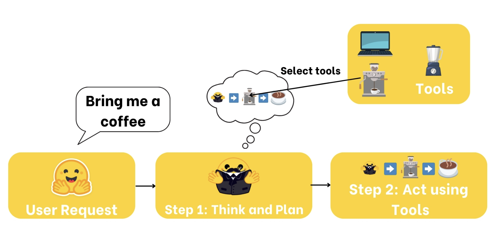
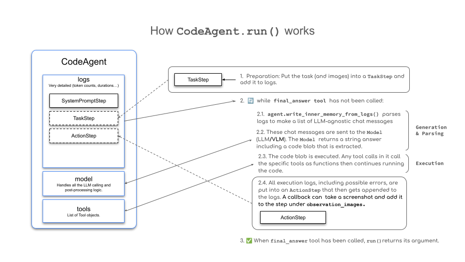
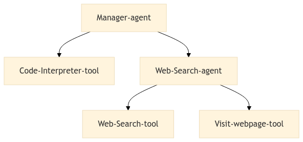

# AI agents

## Refs

* [multi agent patterns](https://developers.googleblog.com/developers-guide-to-multi-agent-patterns-in-adk/)
* [pydantic-deepagents](https://github.com/vstorm-co/pydantic-deepagents)
* [CS329A Self-Improving AI Agents](https://cs329a.stanford.edu/)
* [Multi-Agent Video Recommenders: Evolution, Patterns, and Open Challenges](https://arxiv.org/abs/2604.02211)
* [Small Language Models for Efficient Agentic Tool Calling: Outperforming Large Models with Targeted Fine-tuning](https://arxiv.org/abs/2512.15943)
* [agent skills](https://www.linkedin.com/posts/activity-7420544568703651841-LwmW)
* [linear for agents management](https://www.linkedin.com/posts/markkropf_hello-from-the-floor-of-the-agentic-software-activity-7420544815286689792-b24t)
* [Era of Agentic Organization](https://arxiv.org/abs/2510.26658)
* [Microsoft: Peli’s agents factory](https://www.linkedin.com/posts/mikolajsedek_welcome-to-pelis-agent-factory-github-activity-7428755975676850176-KhGz)
* [Alibaba] long term and short term memory](https://arxiv.org/abs/2601.01885)
* [Agentic Design patterns: google engineer book](https://docs.google.com/document/d/1rsaK53T3Lg5KoGwvf8ukOUvbELRtH-V0LnOIFDxBryE/preview?tab=t.0#)
* [google agents technical guide](https://www.linkedin.com/feed/update/urn:li:activity:7375837282467069952)
* [AGENTS.md](https://www.linkedin.com/posts/sumanth077_finally-a-simple-open-format-for-building-activity-7365289392548036609-TafF)
* [writing agents.md](https://www.linkedin.com/posts/viktormalyi_most-agents-md-files-i-audit-are-useless-activity-7424349225678807041--cNt)
* [cdn.openai.com/business-guides-and-resources/a-practical-guide-to-building-agents.pdf](http://cdn.openai.com/business-guides-and-resources/a-practical-guide-to-building-agents.pdf)
* [agentic protocols](https://www.linkedin.com/posts/sergey-ignatov_last-year-we-saw-lots-of-standards-in-the-activity-7416226657033781248-Waxi)
* [FinAI bot](https://fin.ai/research/)
* [FinAI cx models](https://fin.ai/cx-models)
* [Reranker experiment: data beats model size](https://salespeak.ai/blog/reranker-experiment-data-beats-model-size)
* [Open source agentic search is here](https://www.linkedin.com/posts/mary-newhauser_open-source-agentic-search-is-here-share-7443309648176349184-4vQ_/)
* [Clickhouse MCP](https://clickhouse.com/blog/integrating-clickhouse-mcp)
    - https://github.com/ClickHouse/mcp-clickhouse
* [fastapi_mcp](https://github.com/tadata-org/fastapi_mcp)
* [mcp-use](https://github.com/mcp-use/mcp-use)
* [philoagents-course](https://github.com/neural-maze/philoagents-course)
* [microsoft course](https://github.com/microsoft/ai-agents-for-beginners)
*  [LangGraph course](https://academy.langchain.com/courses/intro-to-langgraph)
* [microsoft agents framework](https://devblogs.microsoft.com/foundry/introducing-microsoft-agent-framework-the-open-source-engine-for-agentic-ai-apps/)
* [MCP githib registry](https://github.com/modelcontextprotocol/registry/tree/main)
* [MCP example](https://codenrock.com/blog/model-context-protocol-dlya-sozdaniya-ai-assistentov-standart-kotoryj-pomozhet-pobezhdat-v-ml-chellendzhah)
* [MCP course (youtube)](https://youtu.be/5xqFjh56AwM?si=a5-NhRtiYc6btUmF)
* [mcp course (youtube)](https://m.youtube.com/watch?v=VfZlglOWWZw)
* [MCP course](https://github.com/decodingml/enterprise-mcp-course)
* [MCP course with anthropic](https://www.deeplearning.ai/short-courses/mcp-build-rich-context-ai-apps-with-anthropic/)
* [MCP HuggingFace course](https://huggingface.co/mcp-course)
    - [anthropic: tools for agents](https://www.anthropic.com/engineering/writing-tools-for-agents)
* [PC usage](https://manus.im/blog/Context-Engineering-for-AI-Agents-Lessons-from-Building-Manus)
    - [manus PC agents](https://manus.im/blog/Context-Engineering-for-AI-Agents-Lessons-from-Building-Manus)
    - [Agentic browser usage](https://docs.browser-use.com/quickstart)
    - [agent mail](https://www.agentmail.to/)
* [whatsapp agent](https://github.com/neural-maze/ava-whatsapp-agent-course?tab=readme-ov-file#course-syllabus)
* [LLaMA cloud agents](https://www.linkedin.com/posts/jerry-liu-64390071_im-excited-to-release-a-post-which-outlines-activity-7320875199615184897-vBZJ)
* [AI agents digest](https://www.linkedin.com/posts/rakeshgohel01_ai-agent-update-week-april-20-26-ugcPost-7322235143727808512-50v1)
* [stanford Agents course](https://rdi.berkeley.edu/llm-agents/f24)
* [astronomer agents](https://github.com/astronomer/agents)
* [redis: context rot](https://redis.io/blog/context-rot/)
* [DSPY agents prompt optimization](https://docs.cloud.google.com/vertex-ai/generative-ai/docs/learn/prompts/prompt-optimizer)
* [promptim](https://blog.langchain.dev/promptim/)
* [im-sick-and-tired-of-prompt-engineering-so-i-m-making-a-prompt-optimizer-part-2-9ff3aa47641d](https://ai.plainenglish.io/im-sick-and-tired-of-prompt-engineering-so-i-m-making-a-prompt-optimizer-part-2-9ff3aa47641d)
* [LangGraph](https://opendatascience.com/the-prompt-optimization-stack/)
* [https://medium.com/@mustangs007/auto-prompt-optimisation-with-dspy-say-good-bye-to-manual-prompt-engineering-b786aef984c3](https://medium.com/@mustangs007/auto-prompt-optimisation-with-dspy-say-good-bye-to-manual-prompt-engineering-b786aef984c3)
* [The Prompt Report: A Systematic Survey of Prompting Techniques](https://www.linkedin.com/feed/update/ugcPost:7208896181089808384)
* [prompt-like-a-data-scientist](https://medium.com/data-science/prompt-like-a-data-scientist-auto-prompt-optimization-and-testing-with-dspy-ff699f030cb7)
* [The Prompt Report: A Systematic Survey of Prompting Techniques](https://arxiv.org/abs/2406.06608)
* [Prompting techniques](https://www.linkedin.com/posts/charlie-hills_how-to-master-chatgpt-4o-the-secret-activity-7240238673642811393-QMed/)
* [Agent’s auto ML: microsoft lightning](https://www.linkedin.com/posts/lewisxl_automl-agents-rl-activity-7400973450946801666-yMy2)
* [sber devices agents](https://youtu.be/7Reld2bpsZI?si=8F9g_vauG_p3IbDv)
* [how to build mcp server in python using fastapi](https://medium.com/@miki_45906/how-to-build-mcp-server-in-python-using-fastapi-d3efbcb3da3a)
* [craziest mcp servers you must try](https://medium.com/everyday-ai/craziest-mcp-servers-you-must-try-f23526a165f5)
* [the model context protocol mcp a complete tutorial](https://medium.com/@nimritakoul01/the-model-context-protocol-mcp-a-complete-tutorial-a3abe8a7f4ef)
* [from noisy docs to fine tuning datasets](https://decodingml.substack.com/p/from-noisy-docs-to-fine-tuning-datasets)
* [Agentic Data generation (huggingface)](https://huggingface.co/blog/mlabonne/agentic-datagen)
* [Building save and alighnment AI chatbots](https://padolsey.medium.com/build-a-safe-informed-ai-chatbot-3485f34486d4)
* [create-a-synthetic-dataset-using-llama-3-1-405b-for-instruction-fine-tuning](https://medium.com/towards-data-science/create-a-synthetic-dataset-using-llama-3-1-405b-for-instruction-fine-tuning-9afc22fb6eef)
* [tool-calling-guide-for-local-llms](https://unsloth.ai/docs/basics/tool-calling-guide-for-local-llms)
* [AlignLLMHumanSurvey](https://github.com/GaryYufei/AlignLLMHumanSurvey)
* [build-e-commerce-shopping-assistant-chatbot-llms](https://getindata.com/blog/build-e-commerce-shopping-assistant-chatbot-llms/)
* [mcp servers explained python and agentic ai tool integration](https://generativeai.pub/mcp-servers-explained-python-and-agentic-ai-tool-integration-aa2ddca6cbe5)
* [long term agentic memory with langgraph](https://www.deeplearning.ai/short-courses/long-term-agentic-memory-with-langgraph/)
* [PLAYLIST: Building AI Apps using LangChain](https://www.youtube.com/playlist?list=PL83Wfqi-zYZH8Boxt51keR4vZUDHpAzoO)
* [Privacy AI Search Using LangChain and Elasticsearch](https://www.youtube.com/watch?v=S-CDlEWzGD4)
* [Introduction to LlamaIndex](https://huggingface.us17.list-manage.com/track/click?u=7f57e683fa28b51bfc493d048&id=8de059927b&e=137c7e08e8&i=b1840313de)
* [meet-ava-the-whatsapp-agent](https://open.substack.com/pub/theneuralmaze/p/meet-ava-the-whatsapp-agent?utm_campaign=post&utm_medium=web)
* [llms-are-just-one-piece-of-the-puzzle-in-activity-7289648412365336576-ZEAM](https://www.linkedin.com/posts/pavan-belagatti_llms-are-just-one-piece-of-the-puzzle-in-activity-7289648412365336576-ZEAM)
* [Learning facts with active reading](https://www.arxiv.org/pdf/2508.09494)
* [ai-agent-with-langgraph-langserve-aws-54c4eb04c640](https://ai.gopubby.com/how-i-built-deployed-an-ai-agent-with-langgraph-langserve-aws-54c4eb04c640)
* [top-12-mcp-servers-i-used-and-activity-7322898843463782400-2b8g](https://www.linkedin.com/posts/philipp-schmid-a6a2bb196_here-are-my-top-12-mcp-servers-i-used-and-activity-7322898843463782400-2b8g)
* [graph_constructing/#llm-graph-transformer](https://python.langchain.com/docs/how_to/graph_constructing/#llm-graph-transformer)
* [lioralex_theres-a-new-python-agent-framework](https://www.linkedin.com/posts/lioralex_theres-a-new-python-agent-framework-that-activity-7328072622204747777-ZqoF)
* [𝐀𝐠𝐞𝐧𝐭𝐢𝐜-𝐑𝐀𝐆-with-langgraph](https://www.linkedin.com/posts/migueloteropedrido_%F0%9D%90%80%F0%9D%90%A0%F0%9D%90%9E%F0%9D%90%A7%F0%9D%90%AD%F0%9D%90%A2%F0%9D%90%9C-%F0%9D%90%91%F0%9D%90%80%F0%9D%90%86-with-langgraph-a-3-activity-7325799064627724288-suS3)
* [terminal based coding agents](https://github.com/rsrohan99/tig)
* [openai-new-tools-for-building-agents/](https://openai.com/index/new-tools-for-building-agents/)
* [computer use agent training](https://www.linkedin.com/posts/anshuizme_reinforcementlearning-machinelearning-datascience-activity-7373635325329362944-iAFQ)
* [agent-workflow-automation-n8n-weaviate](https://weaviate.io/blog/agent-workflow-automation-n8n-weaviate)
* [building-react-agents-from-scratch-a-hands-on-guide-using-gemini-ffe4621d90ae](https://medium.com/google-cloud/building-react-agents-from-scratch-a-hands-on-guide-using-gemini-ffe4621d90ae)
* [build-a-location-aware-agent-using-amazon-bedrock-agents-and-foursquare-apis](https://aws.amazon.com/blogs/machine-learning/build-a-location-aware-agent-using-amazon-bedrock-agents-and-foursquare-apis)
* [How_to_build_a_tool-using_agent_with_Langchain.ipynb](https://github.com/openai/openai-cookbook/blob/main/examples/How_to_build_a_tool-using_agent_with_Langchain.ipynb)
* [build-a-dialogue-chatbot-using-azure-openai-and-langchain](https://djajafer.medium.com/build-a-dialogue-chatbot-using-azure-openai-and-langchain-23a60835cc5)
* [build-a-dialogue-chatbot-using-azure-openai-and-langchain](https://djajafer.medium.com/build-a-dialogue-chatbot-using-azure-openai-and-langchain-23a60835cc5)
* [storing-langchain-conversation-chat-history-to-the-azure-table](https://medium.com/@chinmayvb/storing-langchain-conversation-chat-history-to-the-azure-table-de738f42792a)
* [pinecone:langchain-prompt-templates](https://www.pinecone.io/learn/series/langchain/langchain-prompt-templates/)
* [/langchain/handbook/03-langchain-conversational-memory.ipynb](https://github.com/pinecone-io/examples/blob/master/learn/generation/langchain/handbook/03-langchain-conversational-memory.ipynb)
* [agents/quick_start](https://python.langchain.com/docs/modules/agents/quick_start)
* [memory/adding_memory](https://python.langchain.com/docs/modules/memory/adding_memory)
* [langchain.com/memory/conversational_customization](https://python.langchain.com/docs/modules/memory/conversational_customization)
* [LangChain Cookbook Part 2 - Use Cases.ipynb](https://github.com/gkamradt/langchain-tutorials/blob/main/LangChain%20Cookbook%20Part%202%20-%20Use%20Cases.ipynb)
* [langchain/memory/types/buffer](https://python.langchain.com/docs/modules/memory/types/buffer)
* [langchain-building-language-model-applications](https://medium.com/@princekrampah/langchain-building-language-model-applications-c54cfe7219cb
* [tutorials/extraction](https://python.langchain.com/docs/tutorials/extraction/
* [how_to/chatbots_memory](https://python.langchain.com/docs/how_to/chatbots_memory/
* [langchain-ai.github.io/langgraph](https://langchain-ai.github.io/langgraph/
* [how-to-make-an-ai-agent-in-10-minutes-with-langchain](https://dev.to/timesurgelabs/how-to-make-an-ai-agent-in-10-minutes-with-langchain-3i2n)
* [AI agents for visualizations](https://medium.com/firebird-technologies/building-an-agent-for-data-visualization-plotly-39310034c4e9)
* [mongodb-developer/GenAI-Showcase](https://github.com/mongodb-developer/GenAI-Showcase)
* [Agentic patterns](https://www.linkedin.com/posts/migueloteropedrido_mlops-machinelearning-datascience-activity-7239895938209640449-Jjhj)


## Agents architecture

* [Agent Design Pattern Catalogue: A Collection of Architectural Patterns for Foundation Model based Agents](https://arxiv.org/pdf/2405.10467)
- [How to design AI Agent Architecture with patterns | LinkedIn](https://www.linkedin.com/posts/rakeshgohel01_dont-waste-every-day-reinventing-your-ai-activity-7321515242390249472-vYzv)
- [nebius: agents on scale](https://nebius.com/blog/posts/launch-production-agents-at-scale)
- [Agentic System Workflow Patterns | LinkedIn](https://www.linkedin.com/posts/aurimas-griciunas_llm-ai-machinelearning-activity-7325103989090369536-MAtW/)
- [multi-agents architecture](https://userjot.com/blog/best-practices-building-agentic-ai-systems)
- [JetBrains/Mellum-4b-base · Hugging Face](https://huggingface.co/JetBrains/Mellum-4b-base)
- [Looking for a coding assistant that can handle new APIs | LinkedIn](https://www.linkedin.com/posts/egorkraev_can-anyone-recommend-a-coding-assistant-that-activity-7316073342254440448-Huc_)
- [LLM agents - Agent Development Kit (ADK)](https://google.github.io/adk-docs/agents/llm-agents/#planner)
- [Multi-agent systems - Agent Development Kit (ADK)](https://google.github.io/adk-docs/agents/multi-agents/)
- [Vertex AI Agent Engine overview | Google Cloud](https://docs.cloud.google.com/agent-builder/agent-engine/overview)
- [claude code spec driven development](https://github.com/glittercowboy/get-shit-done)
- [agentic meetup](https://www.youtube.com/watch?v=Fa9iRa9H9zM)
- [Architecting secure enterprise AI agents with MCP | IBM](https://www.ibm.com/downloads/documents/us-en/1443d5dd174f42e6)
- [MCP in Enterprise: Challenges, the Desired Outcome, and Ideas | Medium](https://medium.com/@annakokovina21/mcp-in-enterprise-challenges-the-desired-outcome-and-ideas-17bbc0902d3d)
- [OpenAI agent builder](https://youtu.be/44eFf-tRiSg?si=L9r1_jmz_bvhNhRv)
- [LLM agents](https://www.linkedin.com/feed/update/ugcPost:7219980531155828737)
- [automating code review with PydanticAI](https://pydantic.dev/articles/scaling-open-source-with-ai)

Agent starts with reasoning and planning

Once he has a plan, he **must act**. To execute his plan, **he can use tools from the list of tools he knows about**.

This is what an Agent is: an **AI model capable of reasoning, planning, and interacting with its environment**.



An Agent is a system that leverages an AI model to interact with its environment in order to achieve a user-defined objective. It combines reasoning, planning, and the execution of actions (often via external tools) to fulfill tasks.

- **Understand natural language:** Interpret and respond to human instructions in a meaningful way.
- **Reason and plan:** Analyze information, make decisions, and devise strategies to solve problems.
- **Interact with its environment:** Gather information, take actions, and observe the results of those actions

### ReAct

Agents work in a continuous cycle of: **thinking (Thought) → acting (Act) and observing (Observe)**.

Let’s break down these actions together:

1. **Thought**: The LLM part of the Agent decides what the next step should be.
2. **Action:** The agent takes an action, by calling the tools with the associated arguments.
3. **Observation:** The model reflects on the response from the tool.

Agent’s thoughts

| **Type of Thought** | **Example** |
| --- | --- |
| Planning | “I need to break this task into three steps: 1) gather data, 2) analyze trends, 3) generate report” |
| Analysis | “Based on the error message, the issue appears to be with the database connection parameters” |
| Decision Making | “Given the user’s budget constraints, I should recommend the mid-tier option” |
| Problem Solving | “To optimize this code, I should first profile it to identify bottlenecks” |
| Memory Integration | “The user mentioned their preference for Python earlier, so I’ll provide examples in Python” |
| Self-Reflection | “My last approach didn’t work well, I should try a different strategy” |
| Goal Setting | “To complete this task, I need to first establish the acceptance criteria” |
| Prioritization | “The security vulnerability should be addressed before adding new features” |

**ReAct approach:** the concatenation of “Reasoning” (Think) with “Acting” (Act).

Observations are **how an Agent perceives the consequences of its actions**.

They provide crucial information that fuels the Agent’s thought process and guides future actions.

In the observation phase, the agent:

- **Collects Feedback:** Receives data or confirmation that its action was successful (or not).
- **Appends Results:** Integrates the new information into its existing context, effectively updating its memory.
- **Adapts its Strategy:** Uses this updated context to refine subsequent thoughts and actions.

| **Type of Observation** | **Example** |
| --- | --- |
| System Feedback | Error messages, success notifications, status codes |
| Data Changes | Database updates, file system modifications, state changes |
| Environmental Data | Sensor readings, system metrics, resource usage |
| Response Analysis | API responses, query results, computation outputs |
| Time-based Events | Deadlines reached, scheduled tasks completed |

After performing an action, the framework follows these steps in order:

1. **Parse the action** to identify the function(s) to call and the argument(s) to use.
2. **Execute the action.**
3. **Append the result** as an **Observation**.

Refs

- [https://huggingface.co/blog/smolagents](https://huggingface.co/blog/smolagents)

Create a CodeAgent with DuckDuckGo search capability

How to set up [HfApi model](https://huggingface.co/docs/smolagents/en/reference/models#smolagents.HfApiModel)

```python
from smolagents import CodeAgent, DuckDuckGoSearchTool, HfApiModel

model = HfApiModel(
  model_id='Qwen/Qwen2.5-Coder-32B-Instruct',
)

search_tool = DuckDuckGoSearchTool()
agent = CodeAgent(
    tools=[search_tool],
    model=model
)
```

# Function calling

Function-calling is a **way for an LLM to take actions on its environment.**  The function calling capacity **is learned by the model**, and relies **less on prompting than other agents techniques**. With function-calling, the Agent is fine-tuned (trained) to use Tools.

New roles added to chat template: **Action** and **Observation**.

- Example from Mistral API
    
    ```python
    conversation = [
        {
            "role": "user",
            "content": "What's the status of my transaction T1001?"
        },
        {
            "role": "assistant",
            "content": "",
            "function_call": {
                "name": "retrieve_payment_status",
                "arguments": "{\"transaction_id\": \"T1001\"}"
            }
        },
        {
            "role": "tool",
            "name": "retrieve_payment_status",
            "content": "{\"status\": \"Paid\"}"
        },
        {
            "role": "assistant",
            "content": "Your transaction T1001 has been successfully paid."
        }
    ]
    ```
    

A model training process can be divided into 3 steps:

1. **The model is pre-trained on a large quantity of data**. The output of that step is a **pre-trained model**. For instance, [**google/gemma-2-2b**](https://huggingface.co/google/gemma-2-2b). It’s a base model and only knows how **to predict the next token without strong instruction following capabilities**.
2. To be useful in a chat context, the model then needs to be **fine-tuned** to follow instructions. In this step, it can be trained by model creators, the open-source community, you, or anyone. For instance, [**google/gemma-2-2b-it**](https://huggingface.co/google/gemma-2-2b-it) is an instruction-tuned model by the Google Team behind the Gemma project.
3. The model can then be **aligned** to the creator’s preferences. For instance, a customer service chat model that must never be impolite to customers.

## Agents framework

Framework includes several components

- An *LLM engine* that powers the system.
- A *list of tools* the agent can access.
- A *parser* for extracting tool calls from the LLM output.
- A *system prompt* synced with the parser.
- A *memory system*.
- *Error logging and retry mechanisms* to control LLM mistakes. We’ll explore how these topics are resolved in various frameworks, includi

Code  agent  executes a series of steps to solve a task cycles through writing internal thoughts, generating Python code, executing the code, and logging the results until it arrives at a final answer

Most popular frameworks: `smolagents`, `LlamaIndex`, and `LangGraph`.

That **tool-calling LLMs** work more effectively with code directly (traditional approaches use a JSON format to specify tool names and arguments as strings, **which the system must parse to determine which tool to execute)**. 

Writing actions in code rather than JSON offers several key advantages:

- **Composability**: Easily combine and reuse actions
- **Object Management**: Work directly with complex structures like images
- **Generality**: Express any computationally possible task
- **Natural for LLMs**: High-quality code is already present in LLM training data



- code example
    
    ```python
    from huggingface_hub import notebook_login
    
    notebook_login()
    
    from smolagents import CodeAgent, DuckDuckGoSearchTool, HfApiModel
    
    agent = CodeAgent(tools=[DuckDuckGoSearchTool()], model=HfApiModel())
    agent.run(
    """Search for the best music recommendations for a party
    at the Wayne's mansion."""
    )
    
    # create a tool using @tool decorator
    from smolagents import CodeAgent, tool
    
    @tool
    def suggest_menu(occasion: str) -> str:
        """
        Suggests a menu based on the occasion.
        Args:
            occasion: The type of occasion for the party.
        """
        if occasion == "casual":
            return "Pizza, snacks, and drinks."
        elif occasion == "formal":
            return "3-course dinner with wine and dessert."
        elif occasion == "superhero":
            return "Buffet with high-energy and healthy food."
        else:
            return "Custom menu for the butler."
    
    # additional_authorized_imports - for any required external tools
    agent = CodeAgent(tools=[suggest_menu], model=HfApiModel(), additional_authorized_imports=['datetime'])
    agent.run("Prepare a formal menu for the party.")
    ```
    
    **Tool Calling Agents**, the second type of agent available in `smolagents`.
    

```json
[
    {"name": "web_search", "arguments": "Best catering services in Gotham City"},
    {"name": "web_search", "arguments": "Party theme ideas for superheroes"}
]
```

Tool Calling Agents **generate JSON objects that specify tool names and arguments.**

```python
from smolagents import ToolCallingAgent, DuckDuckGoSearchTool, HfApiModel

agent = ToolCallingAgent(tools=[DuckDuckGoSearchTool()], model=HfApiModel())

agent.run("Search for the best music recommendations for a party at the Wayne's mansion.")
```

To interact with a tool, the LLM needs an **interface description** with these key components:

- **Name**: What the tool is called
- **Tool description**: What the tool does
- **Input types and descriptions**: What arguments the tool accepts
- **Output type**: What the tool returns

In `smolagents`, tools can be defined in two ways:

1. **Using the `@tool` decorator** for simple function-based tools
2. **Creating a subclass of `Tool`** for more complex functionality

```python
from smolagents import CodeAgent, HfApiModel, tool

@tool
def catering_service_tool(query: str) -> str:
    """
    This tool returns the highest-rated catering service in Gotham City.
    
    Args:
        query: A search term for finding catering services.
    """
    services = {
        "Gotham Catering Co.": 4.9,
        "Wayne Manor Catering": 4.8,
        "Gotham City Events": 4.7,
    }
    best_service = max(services, key=services.get)
    
    return best_service

agent = CodeAgent(tools=[catering_service_tool], model=HfApiModel())
result = agent.run(
    "Can you give me the name of the highest-rated catering service in Gotham City?"
)

print(result)   # Output: Gotham Catering Co.
```

# Agentic RAG

https://huggingface.co/learn/cookbook/agent_rag

- expand code
    
    ```python
    from langchain.docstore.document import Document
    from langchain.text_splitter import RecursiveCharacterTextSplitter
    from smolagents import Tool
    from langchain_community.retrievers import BM25Retriever
    from smolagents import CodeAgent, HfApiModel
    
    class PartyPlanningRetrieverTool(Tool):
        name = "party_planning_retriever"
        description = "Uses semantic search to retrieve relevant party planning ideas for Alfred’s superhero-themed party at Wayne Manor."
        inputs = {
            "query": {
                "type": "string",
                "description": "The query to perform. This should be a query related to party planning or superhero themes.",
            }
        }
        output_type = "string"
    
        def __init__(self, docs, **kwargs):
            super().__init__(**kwargs)
            self.retriever = BM25Retriever.from_documents(
                docs, k=5  # Retrieve the top 5 documents
            )
    
        def forward(self, query: str) -> str:
            assert isinstance(query, str), "Your search query must be a string"
    
            docs = self.retriever.invoke(
                query,
            )
            return "\nRetrieved ideas:\n" + "".join(
                [
                    f"\n\n===== Idea {str(i)} =====\n" + doc.page_content
                    for i, doc in enumerate(docs)
                ]
            )
    
    # Simulate a knowledge base about party planning
    party_ideas = [
        {"text": "A superhero-themed masquerade ball with luxury decor, including gold accents and velvet curtains.", "source": "Party Ideas 1"},
        {"text": "Hire a professional DJ who can play themed music for superheroes like Batman and Wonder Woman.", "source": "Entertainment Ideas"},
        {"text": "For catering, serve dishes named after superheroes, like 'The Hulk's Green Smoothie' and 'Iron Man's Power Steak.'", "source": "Catering Ideas"},
        {"text": "Decorate with iconic superhero logos and projections of Gotham and other superhero cities around the venue.", "source": "Decoration Ideas"},
        {"text": "Interactive experiences with VR where guests can engage in superhero simulations or compete in themed games.", "source": "Entertainment Ideas"}
    ]
    
    source_docs = [
        Document(page_content=doc["text"], metadata={"source": doc["source"]})
        for doc in party_ideas
    ]
    
    text_splitter = RecursiveCharacterTextSplitter(
        chunk_size=500,
        chunk_overlap=50,
        add_start_index=True,
        strip_whitespace=True,
        separators=["\n\n", "\n", ".", " ", ""],
    )
    docs_processed = text_splitter.split_documents(source_docs)
    party_planning_retriever = PartyPlanningRetrieverTool(docs_processed)
    agent = CodeAgent(tools=[party_planning_retriever], model=HfApiModel())
    response = agent.run(
        "Find ideas for a luxury superhero-themed party, including entertainment, catering, and decoration options."
    )
    
    print(response)
    ```
    

# Multi-agent systems

Multi-agent systems enable **specialized agents to collaborate on complex tasks**, improving modularity, scalability, and robustness. Instead of relying on a single agent, tasks are distributed among agents with distinct capabilities.

The diagram below illustrates a simple multi-agent architecture where a **Manager Agent** coordinates a **Code Interpreter Tool** and a **Web Search Agent**, which in turn utilizes tools like the `DuckDuckGoSearchTool` and `VisitWebpageTool` to gather relevant information.



Create web agent and manager agent structure

```python
from smolagents import CodeAgent, ToolCallingAgent, DuckDuckGoSearchTool, HfApiModel

model = HfApiModel(model_id="Qwen/Qwen2.5-Coder-32B-Instruct")
search_tool = DuckDuckGoSearchTool()
web_agent = ToolCallingAgent(
    tools=[search_tool, VisitWebpageTool()],
    model=model,
    max_steps=10,
    name="web_search_agent",
    description="Search web to get up-to-date results" 
)

manager_agent = CodeAgent(
    model=model,
    tools=[],
    managed_agents=[web_agent],
    additional_authorized_imports=[
        "time", "numpy", "pandas"
    ],
    planning_interval=5,
    verbosity_level=2,
    max_steps=15,
)
```

Security code agents: [https://smolagents.org/docs/secure-code-execution-of-smolagents/](https://smolagents.org/docs/secure-code-execution-of-smolagents/)

```python
from smolagents import CodeAgent

agent = CodeAgent(
    tools=[],
    model=model,
    additional_authorized_imports=["numpy"],
    sandbox=E2BSandbox()
)
```

Tool calling -

```python
from smolagents import ToolCallingAgent, DuckDuckGoSearchTool, HfApiModel

agent = ToolCallingAgent(
    tools=[DuckDuckGoSearchTool()],
    model=HfApiModel(model_id="Qwen/Qwen2.5-Coder-32B-Instruct"),
    additional_authorized_imports=[
        "numpy",
    ],
    max_steps=5,
    name="web_search_agent",
    description="Search web to get up-to-date results",
    sandbox=E2BSandbox()
)
```

Model integration

```python
from smolagents import LiteLLMModel

model = LiteLLMModel("anthropic/claude-3-5-sonnet-latest", temperature=0.2, max_tokens=10)

messages = [
  {"role": "user", "content": [{"type": "text", "text": "Hello, how are you?"}]}
]

print(model(messages))
```

### LLamaIndex

- [https://docs.llamaindex.ai/en/stable/understanding/agent/](https://docs.llamaindex.ai/en/stable/understanding/agent/)
- [https://docs.llamaindex.ai/en/stable/examples/agent/agent_workflow_basic/](https://docs.llamaindex.ai/en/stable/examples/agent/agent_workflow_basic/)

three main parts that help build agents in LlamaIndex

- **Components** are the basic building blocks you use in LlamaIndex. These include things like prompts, models and databases. Components often help connect LlamaIndex with other tools and libraries.
- **Tools**: Tools are components that provide specific capabilities like searching, calculating, or accessing external services. They are the building blocks that enable agents to perform tasks.
- **Agents**: Agents are autonomous components that can use tools and make decisions. They coordinate tool usage to accomplish complex goals.
- **Workflows** are step-by-step processes that process logic together. Workflows or agentic workflows are a way to structure agentic behaviour without the explicit use of agents.
- ingestion
    
    ```python
    from llama_index.core import Document
    from llama_index.embeddings.huggingface_api import HuggingFaceInferenceAPIEmbedding
    from llama_index.core.node_parser import SentenceSplitter
    from llama_index.core.ingestion import IngestionPipeline
    
    # create the pipeline with transformations
    pipeline = IngestionPipeline(
        transformations=[
            SentenceSplitter(chunk_overlap=0),
            HuggingFaceInferenceAPIEmbedding(model_name="BAAI/bge-small-en-v1.5"),
        ]
    )
    
    nodes = await pipeline.arun(documents=[Document.example()])
    ```
    
- store
    
    ```python
    import chromadb
    from llama_index.vector_stores.chroma import ChromaVectorStore
    
    db = chromadb.PersistentClient(path="./alfred_chroma_db")
    chroma_collection = db.get_or_create_collection("alfred")
    vector_store = ChromaVectorStore(chroma_collection=chroma_collection)
    
    pipeline = IngestionPipeline(
        transformations=[
            SentenceSplitter(chunk_size=25, chunk_overlap=0),
            HuggingFaceInferenceAPIEmbedding(model_name="BAAI/bge-small-en-v1.5"),
        ],
        vector_store=vector_store,
    )
    ```
    
- indexing
    
    ```python
    from llama_index.core import VectorStoreIndex
    from llama_index.embeddings.huggingface_api import HuggingFaceInferenceAPIEmbedding
    
    embed_model = HuggingFaceInferenceAPIEmbedding(model_name="BAAI/bge-small-en-v1.5")
    index = VectorStoreIndex.from_vector_store(vector_store, embed_model=embed_model)
    ```
    
- querying
    
    ```python
    from llama_index.llms.huggingface_api import HuggingFaceInferenceAPI
    
    llm = HuggingFaceInferenceAPI(model_name="Qwen/Qwen2.5-Coder-32B-Instruct")
    query_engine = index.as_query_engine(
        llm=llm,
        response_mode="tree_summarize",
    )
    query_engine.query("What is the meaning of life?")
    ```
    
- evaluation
    
    ```python
    from llama_index.core.evaluation import FaithfulnessEvaluator
    
    query_engine = # from the previous section
    llm = # from the previous section
    
    # query index
    evaluator = FaithfulnessEvaluator(llm=llm)
    response = query_engine.query(
        "What battles took place in New York City in the American Revolution?"
    )
    eval_result = evaluator.evaluate_response(response=response)
    eval_result.passing
    ```
    

We created **the `QueryEngine` as a tool for an agent!**

Tools in LLaMA index

1. `FunctionTool`: Convert any Python function into a tool that an agent can use. It automatically figures out how the function works.
2. `QueryEngineTool`: A tool that lets agents use query engines. Since agents are built on query engines, they can also use other agents as tools.
3. `Toolspecs`: Sets of tools created by the community, which often include tools for specific services like Gmail.
4. `Utility Tools`: Special tools that help handle large amounts of data from other tools.
- tool creating
    
    ```python
    from llama_index.core.tools import FunctionTool
    
    def get_weather(location: str) -> str:
        """Useful for getting the weather for a given location."""
        print(f"Getting weather for {location}")
        return f"The weather in {location} is sunny"
    
    tool = FunctionTool.from_defaults(
        get_weather,
        name="my_weather_tool",
        description="Useful for getting the weather for a given location.",
    )
    tool.call("New York")
    ```
    
- QueryEngine tool
    
    ```python
    from llama_index.core import VectorStoreIndex
    from llama_index.core.tools import QueryEngineTool
    from llama_index.llms.huggingface_api import HuggingFaceInferenceAPI
    from llama_index.embeddings.huggingface_api import HuggingFaceInferenceAPIEmbedding
    from llama_index.vector_stores.chroma import ChromaVectorStore
    
    embed_model = HuggingFaceInferenceAPIEmbedding("BAAI/bge-small-en-v1.5")
    
    db = chromadb.PersistentClient(path="./alfred_chroma_db")
    chroma_collection = db.get_or_create_collection("alfred")
    vector_store = ChromaVectorStore(chroma_collection=chroma_collection)
    
    index = VectorStoreIndex.from_vector_store(vector_store, embed_model=embed_model)
    
    llm = HuggingFaceInferenceAPI(model_name="Qwen/Qwen2.5-Coder-32B-Instruct")
    query_engine = index.as_query_engine(llm=llm)
    tool = QueryEngineTool.from_defaults(query_engine, name="some useful name", description="some useful description")
    ```
    

 `ToolSpec` combines related tools for specific purposes.

Types of LLaMA index agents

1. `Function Calling Agents` - These work with AI models that can call specific functions.
2. `ReAct Agents` - These can work with any AI that does chat or text endpoint and deal with complex reasoning tasks.
3. `Advanced Custom Agents` - These use more complex methods to deal with more complex tasks and workflows.

LLama workflows

**Workflows offer several key benefits:**

- Clear organization of code into discrete steps
- Event-driven architecture for flexible control flow
- Type-safe communication between steps
- Built-in state management
- Support for both simple and complex agent interactions