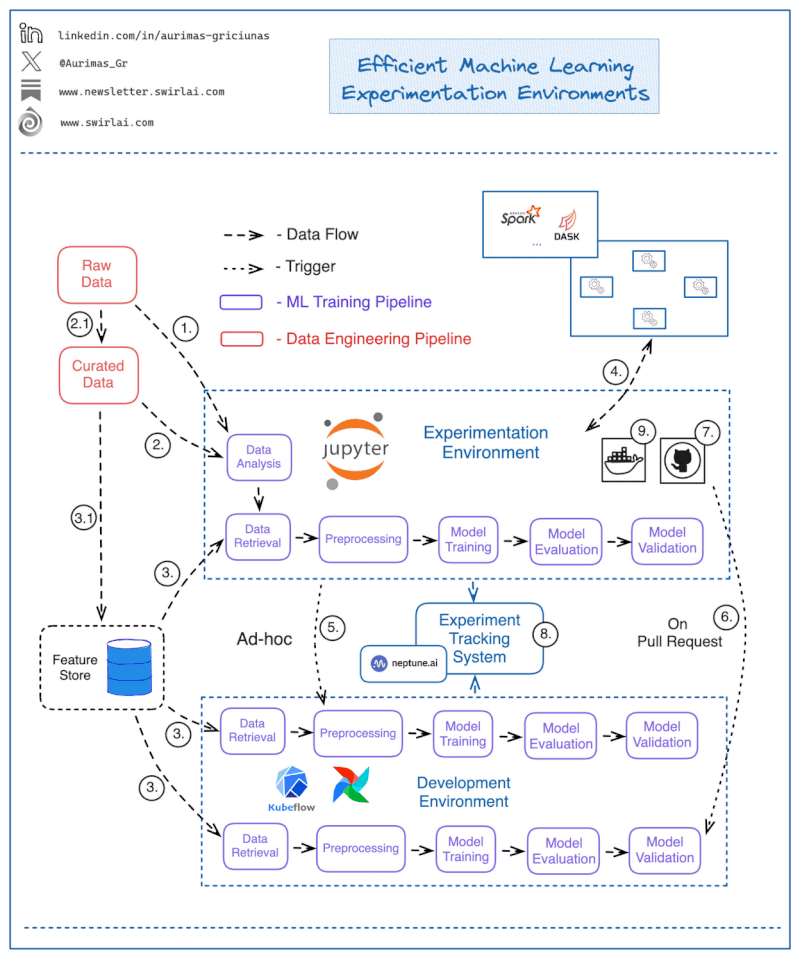

# Введение в MLOps



References
* [genai-platform](https://huyenchip.com/2024/07/25/genai-platform.html)
* [ml system design](https://www.linkedin.com/feed/update/activity:7274347641138728961)
* [MLOps maturity model](https://www.linkedin.com/feed/update/activity:7229381328490622976)

## Шаг 1: среда разработки

Скачать дамп [messages.db](https://drive.google.com/file/d/1Ej6pV_GAXFDGxMk45Dntn2pnSlnn6IRs/view?usp=sharing) и положить в директорию [data](./data)

Запустить сборку докер-контейнера для разработки

```shell
make build
```

## Шаг 2

Этап EDA (Exploratory Data Analysis) - запускаем Jupyter чтобы "покопаться" в данных

```shell
make notebook
```

Открываем браузер по ссылке [localhost:8888](http://localhost:8888/)

После EDA сохраняем файл [scored_corpus.csv](https://drive.google.com/file/d/1lRpQOCwxwt0JAU9wDUOvhJ3CaYZMYFO_/view?usp=share_link) в директорию `data` (либо можно скачать из google drive по ссылке)

# Шаг 3: Эксплуатация модели

Скачиваем размеченный датасет [по ссылке](https://drive.google.com/file/d/1MrxsEbeeJnIMdjL_GjsYysdKADyF5EQo/view?usp=sharing)

добавляем модель с микросервис

* [__main__](../src/train.py) - обучить модель с качеством f1 больше 0.86106
    *  Bert для фичей
    * более сложная модель (бустинг?)
* [pridict_labell](../src/service.py) - загрузить модель в сервис и реализовать API
    * `feed`
    * `/messages/<string:identifier>'`
* прислать PR в репозиторий

# Experimentation environment

What does an 𝗘𝗳𝗳𝗲𝗰𝘁𝗶𝘃𝗲 𝗠𝗮𝗰𝗵𝗶𝗻𝗲 𝗟𝗲𝗮𝗿𝗻𝗶𝗻𝗴 𝗘𝘅𝗽𝗲𝗿𝗶𝗺𝗲𝗻𝘁𝗮𝘁𝗶𝗼𝗻 𝗘𝗻𝘃𝗶𝗿𝗼𝗻𝗺𝗲𝗻𝘁 look like?

MLOps practices are there to improve Machine Learning Product development velocity, the biggest bottlenecks happen when Experimentation Environments and other infrastructure elements are integrated poorly.

Let’s look into the properties that an effective Experimentation Environment should have. As a MLOps engineer you should strive to provide these to your users and as a Data Scientist, you should know what you should be demanding for.

𝟭: Access to the raw data. While handling raw data is the responsibility of Data Engineering function, Data Scientists need the ability to explore and analyze available raw data and decide which of it needs to be moved upstream the Data Value Chain (2.1).

𝟮: Access to the curated data. Curated data might be available in the Data Warehouse but not exposed via a Feature Store. Such Data should not be exposed for model training in production environments. Data Scientists need the ability to explore curated data and see what needs to be pushed downstream (3.1).

𝟯: Data used for training of Machine Learning models should be sourced from a Feature Store if the ML Training pipeline is ready to be moved to the production stage.

𝟰: Data Scientists should be able to easily spin up different types of compute clusters - might it be Spark, Dask or any other technology - to allow effective Raw and Curated Data exploration.

𝟱: Data Scientists should be able to spin up a production like remote Machine Learning Training pipeline in development environment ad-hoc from the Notebook, this increases speed of iteration significantly.

𝟲: There should be an automated setup in place that would perform the testing and promotion to a higher env when a specific set of Pull Requests are created. E.g. a PR from feature/* to release/* branch could trigger a CI/CD process to test and deploy the ML Pipeline to a pre-prod environment.

𝟳: Notebooks and any additional boilerplate code for CI/CD should be part of your Git integration. Make it crystal clear where a certain type of code should live - a popular way to do this is providing repository templates with clear documentation.

𝟴: Experiment/Model Tracking System should be exposed to both local and remote pipelines.

𝟗: Notebooks have to be running in the same environment that your production code will run in. Incompatible dependencies should not cause problems when porting applications to production. It can be achieved by running Notebooks in containers.

### General Trade-offs to Demonstrate

| Trade-off | Considerations |
|---|---|
| **Availability vs Consistency** | CAP theorem. For ML serving, availability is usually prioritised — a stale prediction is better than no prediction. Use eventual consistency for feature stores. |
| **Storage** | Hot/warm/cold tiers: Redis (hot, < 1 ms) → Cassandra/DynamoDB (warm, < 10 ms) → S3/BigQuery (cold, seconds–minutes). Move data down tiers as it ages. |
| **Messaging** | Kafka for durable, high-throughput event streaming. Use consumer groups for parallel processing. Partition by user/entity ID for ordering guarantees within a group. |
| **Caching** | Cache at multiple levels: API response cache, feature cache, embedding cache. TTL must balance freshness with compute savings. |
| **Autoscaling** | Scale inference replicas based on P95 latency or QPS. Be aware of cold-start cost if model loading is slow — keep a warm pool. |
| **Compute** | Batch jobs benefit from spot/preemptible instances (cheap, but can be interrupted — design for idempotency). Real-time serving needs on-demand instances for reliability. |

# CI/CD

Makefile

```python
tag:
	assets/set_git_tag.sh

make pep8:
	autopep8 --in-place --aggressive --aggressive --recursive .

version:
	assets/increment_version.sh && \
	git add setup.py

clean-cache:
	find . | grep -E "(/__pycache__$|\.pyc$|\.pyo$)" | xargs rm -rf

```

Assets set git tag

```python
#!/bin/bash

# Get the current tag name
current_tag=$(git describe --abbrev=0 --tags)

# Parse the current tag and increment the version
old_version=$(echo "$current_tag" | sed -E 's/v([0-9]+\.[0-9]+\.[0-9]+)/\1/')
IFS='.' read -ra version_parts <<< "$old_version"
((version_parts[2]++))
new_version="${version_parts[0]}.${version_parts[1]}.${version_parts[2]}"
new_tag="v$new_version"

# Update the Git tag
git tag -d "$current_tag"           # Delete the old tag locally
git push origin --delete "$current_tag" # Delete the old tag on the remote repository
git tag "$new_tag"                  # Create the new tag locally
git push origin "$new_tag"          # Push the new tag to the remote repository

echo "Git tag updated from $current_tag to $new_tag"
```

Upd version

```python
#!/bin/bash

# Input code file
filename="$(pwd)/setup.py"

# Read the current version
current_version=$(grep -o "version='[0-9.]\+'" "$filename" | cut -d"'" -f2)

# Increment the version
IFS='.' read -ra version_parts <<< "$current_version"
((version_parts[2]++))
new_version="${version_parts[0]}.${version_parts[1]}.${version_parts[2]}"

# Escape slashes in the version string for sed (macOS version)
escaped_current_version=$(echo "$current_version" | sed -E 's/\//\\\//g')
escaped_new_version=$(echo "$new_version" | sed -E 's/\//\\\//g')

# Update the version in the file using sed (macOS version)
sed -i '' "s/version='$escaped_current_version'/version='$escaped_new_version'/g" "$filename"

echo "Version updated from $current_version to $new_version"
```

# ML system design

[PDF:ML system design](img/ml_system_design.pdf)

**System design** is the process of defining components and their integration, APIs, and data models to build large-scale systems that meet a specified set of functional and non-functional requirements.

- computer networking
- parallel computing
- distributed systems

System design aims to build systems that are reliable, effective, and maintainable, among other characteristics.

- **Reliable systems** handle faults, failures, and errors.
- **Effective systems** meet all user needs and business requirements.
- **Maintainable systems** are flexible and easy to scale up or down. The ability to add new features also comes under the umbrella of maintainability.

**Abstraction** is the art of obfuscating details that we don’t need. It allows us to concentrate on the big picture. Looking at the big picture is vital because it hides the inner complexities, thus giving us a broader understanding of our set goals and staying focused on them.

### Interview process

**Ask refining questions**

- Requirements that the clients need directly—for example, the ability to send messages in near real-time to friends. (functional)
- Requirements that are needed indirectly—for example, messaging service performance shouldn’t degrade with increasing user load. (non-functional)

 **Handle the data**

- What’s the size of the data right now?
- At what rate is the data expected to grow over time?
- How will the data be consumed by other subsystems or end users?
- Is the data read-heavy or write-heavy?
- Do we need strict consistency of data, or will eventual consistency work?
- What’s the durability target of the data?
- What privacy and regulatory requirements do we require for storing or transmitting user data?

**Discuss the components**

Front-end components, load balancers, caches, databases, firewalls, and CDNs are just some examples of system components.

**Discuss trade-offs**

Something is always failing in a big system. We need to integrate fault tolerance and security into our design.


# References

* [ML system design interview](https://gist.github.com/aleksandr-dzhumurat/6da16c38a2a692d8d99242145977f82e)
* [Flant: Настраиваем CI/CD с GitHub Actions и werf: инструкция для новичков](https://habr.com/ru/companies/flant/articles/803251/)
* [A Visual Guide to CI/CD (Continuous Integration / Continuous Delivery)](https://www.linkedin.com/posts/sahnlam_a-visual-guide-to-cicd-continuous-integration-activity-7311240881695535106-3C0R)

### Tech blogs

- [Engineering at Meta](https://engineering.fb.com/)
- [Meta Research](https://research.facebook.com/)
- [AWS Architecture Blog](https://aws.amazon.com/blogs/architecture/)
    - [AWS system design example](https://www.linkedin.com/posts/jasser-hasni-18b337168_excited-to-share-my-latest-project-activity-7314331284263124993-lrw2)
- [Amazon Science Blog](https://www.amazon.science/)
- [Netflix TechBlog](https://netflixtechblog.com/)
- [Google Research](https://research.google/)
- [Engineering at Quora](https://quoraengineering.quora.com/)
- [Uber Engineering Blog](https://eng.uber.com/)
- [Databricks Blog](https://databricks.com/blog/category/engineering)
- [Pinterest Engineering](https://medium.com/@Pinterest_Engineering)
- [BlackRock Engineering](https://medium.com/blackrock-engineering)
- [Lyft Engineering](https://eng.lyft.com/)
- [Salesforce Engineering](https://engineering.salesforce.com/)

### ML design interview insights

* [ML system design interview](https://github.com/alirezadir/Machine-Learning-Interviews/blob/main/src/MLSD/ml-system-design.md#3-architectural-components-mvp-logic)
* [25 essential System Design Interview Questions in 2024](https://www.educative.io/blog/system-design-interview-questions)
* [system design patterns](https://www.linkedin.com/posts/alexxubyte_systemdesign-coding-interviewtips-activity-7370493772570263552-QFn_)
* [A complete guide to System Design caching](https://educative.io/blog/system-design-caching)
* [Insights in System Design: Throughput loss due to high fan-in](https://www.educative.io/blog/throughput-loss-high-fan-in)
* [Understanding the Causal Consistency Model](https://www.educative.io/blog/causal-consistency-model)
* [Understanding the Sequential Consistency Model](https://www.educative.io/blog/understanding-sequential-consistency-model)
* [Amazon System Design case study: How Amazon scales for Prime Day](https://www.educative.io/blog/amazon-system-design-prime-day)
* [MLOps maturity model with Azure Machine Learning](https://techcommunity.microsoft.com/blog/machinelearningblog/mlops-maturity-model-with-azure-machine-learning/3520625)
* [system design cheatsheet](https://www.linkedin.com/posts/alexxubyte_systemdesign-coding-interviewtips-activity-7311777929791721473-2WVq)
* [modern hardware numbers for system](https://hellointerview.substack.com/p/modern-hardware-numbers-for-system)
* [System design resources](https://www.linkedin.com/posts/nk-systemdesign-one_if-you-want-to-become-good-at-system-design-activity-7371510462602985472-Dndd)

### Feature store

* [MongoDB AI Integrations](https://www.mongodb.com/docs/atlas/ai-integrations/)
* [Feature store](https://youtu.be/dvPp7OGkEQw?si=oY76g4qU3fJyuk3q)
* [Chronon: Airbnb feature store](https://medium.com/airbnb-engineering/chronon-airbnbs-ml-feature-platform-is-now-open-source-d9c4dba859e8)
* [Feast: ML scoring demo](https://github.com/Redislabs-Solution-Architects/feast-credit-scoring-demo)
* [Feast Demo](https://github.com/feast-dev/feast-demo)
* [feature engineering](https://github.com/EmilHvitfeldt/feature-engineering-az)
* [redis](https://www.linkedin.com/posts/raphaeldelio_if-youre-using-redis-only-to-store-strings-activity-7321143724254662656-IDuL)
* [redis](https://redis.io/blog/spring-release-2025/#)
* [redis](https://youtu.be/BqgJ1XL6Gzs?si=UU7a6h3zaWDDmGPD)
* [ai-dynamo](https://github.com/ai-dynamo/dynamo/releases/tag/v0.1.1)
* [Data Engineering with Python and AI/LLMs – Data Loading Tutorial](https://youtu.be/T23Bs75F7ZQ)
* [hopsworks-examples](https://www.hopsworks.ai/hopsworks-examples)
* [transactions_fraud.py](https://github.com/logicalclocks/hopsworks-tutorials/blob/master/real-time-ai-systems/fraud_online/features/transactions_fraud.py)
* [aws-emr-containers-pipeline](https://docs.dagster.io/guides/build/external-pipelines/aws/aws-emr-containers-pipeline)
* [pyspark-pipeline](https://docs.dagster.io/guides/build/external-pipelines/pyspark-pipeline)
* [Comparing ZenML, Metaflow, and all the other DAG tools](https://www.youtube.com/live/W6hpEO80q20?si=0pCCSn3rXQ6AbG4P)

### LLMOps

* [A Practical Guide to LLM Inference](https://theneuralmaze.substack.com/p/a-practical-guide-to-llm-inference)
* [open-webui](https://github.com/open-webui/open-webui)
* [production-agentic-rag](https://decodingml.substack.com/p/llmops-for-production-agentic-rag)
* [LLM and RAG evaluation framework](https://medium.com/decodingml/the-engineers-framework-for-llm-rag-evaluation-59897381c326)
* [rag-evaluation-with-llm-as-a-judge-synthetic-dataset-creation](https://generativeai.pub/rag-evaluation-with-llm-as-a-judge-synthetic-dataset-creation-7fce566310f5)
* [MLOps-Basics](https://github.com/graviraja/MLOps-Basics)
* [ML platform diagrams](https://www.linkedin.com/posts/eric-riddoch_ive-seen-a-lot-of-ml-platform-diagrams-and-activity-7313557141758349313-uLCM)
* [hopsworks-tutorials-quickstart](https://colab.research.google.com/github/logicalclocks/hopsworks-tutorials/blob/master/quickstart.ipynb)
* [vllm](https://www.hyperstack.cloud/blog/case-study/what-is-vllm-a-guide-to-quick-inference)
* [vllm](https://www.aleksagordic.com/blog/vllm)
* [Hydra params config](https://www.linkedin.com/posts/rhajou_ever-get-lost-managing-config-files-for-your-ugcPost-7319958667787702272-jYud)
* [metadata FS](https://www.linkedin.com/posts/einatorr_metadata-activity-7278054414530072576-fRGD)
* [steaming feature evaluation](https://www.linkedin.com/feed/update/urn:li:activity:7403537288275595264?commentUrn=urn%3Ali%3Acomment%3A%28activity%3A7403537288275595264%2C7403553049492779008%29&dashCommentUrn=urn%3Ali%3Afsd_comment%3A%287403553049492779008%2Curn%3Ali%3Aactivity%3A7403537288275595264%29)
* [using-ai-tools-is-easy-understanding-systems-activity-7419665346183237632-fIDi](https://www.linkedin.com/posts/arazvant_using-ai-tools-is-easy-understanding-systems-activity-7419665346183237632-fIDi)

### MLOps

* [DataBricks MLOps](https://www.youtube.com/playlist?app=desktop&list=PL_MIDuPM12MOcQQjnLDtWCCCuf1Cv-nWL)
* [do4ds.com](https://do4ds.com/chapters/intro.html)
* [LLMOps activities](https://www.linkedin.com/posts/aurimas-griciunas_ai-llm-llmops-activity-7280525594012925952-UdHV)
* [Convert transformers to ONNX](https://www.philschmid.de/convert-transformers-to-onnx)
* [CLIP model proposed by OpenAI and ONNX](https://www.linkedin.com/feed/update/urn:li:activity:7059164636222283776/)
* [streamlining-the-machine-learning-workflow-with-onnx-and-onnx-runtime](https://medium.com/@tam.tamanna18/streamlining-the-machine-learning-workflow-with-onnx-and-onnx-runtime-ba2058487cce)
* [Accelerate and simplify Scikit-learn model inference with ONNX Runtime](https://cloudblogs.microsoft.com/opensource/2020/12/17/accelerate-simplify-scikit-learn-model-inference-onnx-runtime/)
* [clear.ml](https://clear.ml/)
* [seldon.io](https://www.seldon.io/)
* [mlops-a-gentle-introduction-to-mlflow-pipelines](https://medium.com/towards-data-science/mlops-a-gentle-introduction-to-mlflow-pipelines-c7bcec88a6ec)
* [MLOps crash course](https://www.linkedin.com/feed/update/activity:7177319817434005504)
* [MLOps course](https://mlops-coding-course.fmind.dev/index.html)
* [MLOps AWS](https://ai.gopubby.com/mlops-setup-on-aws-with-sagemaker-bff8b8300b53)
* [mlops-in-a-nutshell-model-registry-metadata-store-and-model-pipeline](https://www.notion.so/MLOps-Zoomcamp-2024-1ccfb057164b4778bd9019fd46dd792a?pvs=21)
* [a-simple-ci-cd-setup-for-ml-projects](https://medium.com/towards-data-science/a-simple-ci-cd-setup-for-ml-projects-604de7fd64cd)
* [scraping Medium with python](https://dorianlazar.medium.com/scraping-medium-with-python-beautiful-soup-3314f898bbf5)
* [AWS sagemaker](https://docs.aws.amazon.com/sagemaker/latest/dg/deploy-models-frameworks-triton.html)
* [triton inference](https://youtu.be/ljqyuDxd_H0?si=Vpi4PiGrmHKSbKqg)
* [nebius token factory](https://www.linkedin.com/pulse/inside-nebius-token-factory-architecture-behind-scalable-helen-yu-u8yzc)
* [LitAPI inference](https://www.linkedin.com/posts/arazvant_machinelearning-deeplearning-artificialintelligence-activity-7322537864863334401-qNhA/)
* [GenAI observability](https://www.linkedin.com/posts/aurimas-griciunas_llm-ai-llmops-activity-7318938126280744961-WFls)
* [arazvant_deeplearning-artificialintelligence](https://www.linkedin.com/posts/arazvant_deeplearning-artificialintelligence-machinelearning-activity-7313126744759148544-Gf97)
* [inference providers](https://huggingface.co/blog/inference-providers-nebius-novita-hyperbolic)
* [Quadrant n8n node](https://www.linkedin.com/posts/evgeniya-sukhodolskaya_qdrant-dropped-an-official-n8n-node-with-activity-7336800664754270209-h8Lq)
* [How to Whitelabel Your n8n AI Agent INSTANTLY](https://youtu.be/vid7271a6jo?si=034NxQAPHY8Ket2t)
* [zenml](https://www.zenml.io/blog/llmops-is-about-people-too-the-human-element-in-ai-engineering)
* [litserve](https://neuralbits.substack.com/p/a-complete-tutorial-on-litservelitapi)
* [second-brain-ai-assistant-course](https://github.com/decodingml/second-brain-ai-assistant-course/tree/main)
* [sglang](https://www.linkedin.com/posts/philipp-schmid-a6a2bb196_what-is-sglang-and-why-does-it-matter-sglang-activity-7296907885588959232-BylZ)
* [vllm-project](https://github.com/vllm-project/production-stack/tree/main/tutorials)
* [pandas-ai](https://docs.pandas-ai.com/intro) 
* [ML platform at IBM](https://www.linkedin.com/posts/armand-ruiz_ibm-open-source-our-ai-platform-watsonx-activity-7331997645319675904-vG3_)
* [skypilot](https://github.com/skypilot-org/skypilot)
* [n8n](https://www.linkedin.com/posts/ghiles-ms-b36218250_n8n-workflows-to-fine-tune-gpt-to-give-it-activity-7309180583165784064-iC6P)
* [nebius](https://nebius.com/blog/posts/fine-tuning-llms-with-nebius-ai-studio)
* [platform.openai.com/docs/guides/fine-tuning/use-a-fine-tuned-model](https://platform.openai.com/docs/guides/fine-tuning/use-a-fine-tuned-model)
* [fine tune LLaMA on 7b Titanium](https://www.philschmid.de/fine-tune-llama-7b-trainium)
* [Dialog mode fine tuning](https://www.kaggle.com/code/danielhanchen/kaggle-llama-3-1-8b-conversational-unsloth/notebook)
* [Gemma 4 fine tune](https://www.linkedin.com/posts/sarthakrastogi_ai-llms-genai-share-7451889809469591552-RndI)
* [self-hosting-llama-3-1-70b](https://medium.com/@abhinand05/self-hosting-llama-3-1-70b-or-any-70b-llm-affordably-2bd323d72f8d)

### Microsoft stack

- https://learn.microsoft.com/en-us/azure/ai-studio/
- https://learn.microsoft.com/en-us/azure/ai-studio/concepts/retrieval-augmented-generation
- https://learn.microsoft.com/en-us/azure/databricks/generative-ai/retrieval-augmented-generation
- https://www.microsoft.com/en-us/research/blog/graphrag-unlocking-llm-discovery-on-narrative-private-data/
- https://learn.microsoft.com/en-us/azure/ai-studio/concepts/retrieval-augmented-generation
- [Asure OpenAI](https://docs.llamaindex.ai/en/stable/examples/customization/llms/AzureOpenAI/)
- [Asure SearchAI](https://medium.com/microsoftazure/incrementally-indexing-documents-with-azureai-search-integrated-vectorization-6f7150556f62)
- https://github.com/microsoft/promptflow-rag-project-template/tree/main
- https://ai.gopubby.com/microsofts-graphrag-autogen-ollama-chainlit-fully-local-free-multi-agent-rag-superbot-61ad3759f06f