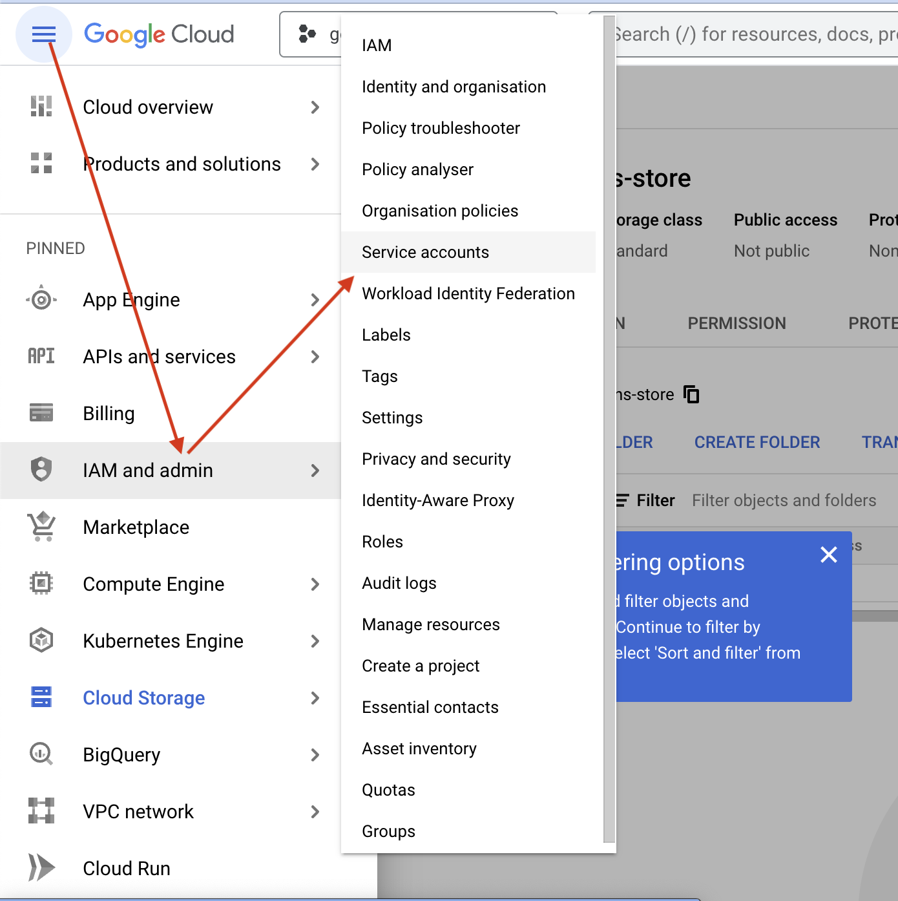
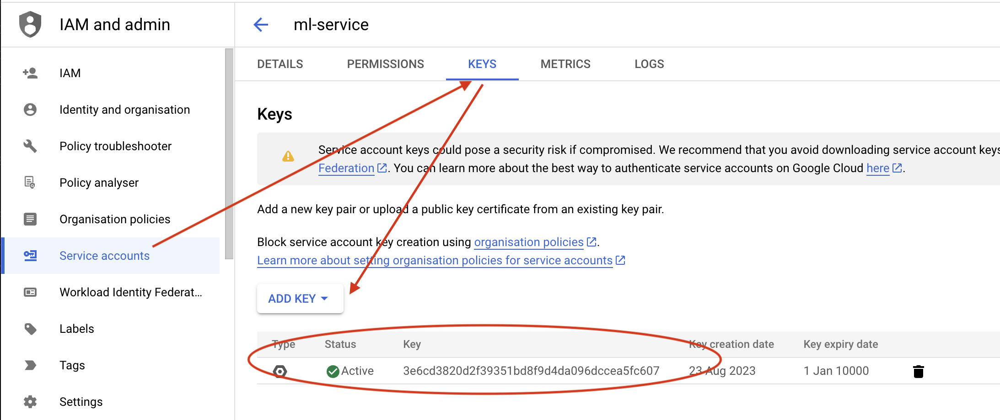
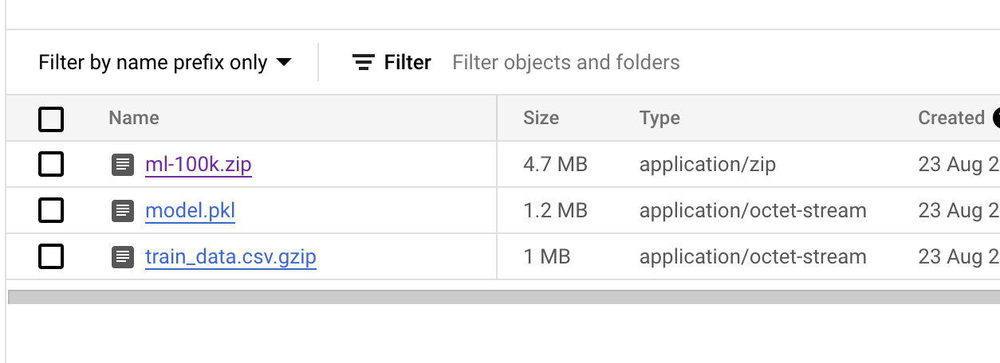

# Google Cloud Store: data and csv

How to switch-on and use for data analysis

Create bucket in [Google Cloud Console](https://console.cloud.google.com/storage/browser) (like an in you own operating system)

- Creating new account
    
    
    

Then go to to “Service accounts”, find ACC that you just created, Click on it and go to “Keys” tab to create key file in JSON format

- create key
    
    
    

You can find description of this process in the [medium article](https://medium.com/google-cloud/automating-google-cloud-storage-management-with-python-92ba64ec8ea8)

I uploaded [movielens 100k](https://grouplens.org/datasets/movielens/100k/) dataset.

Return to [buckets](https://console.cloud.google.com/storage/browser) and upload file in [interface](https://console.cloud.google.com/storage/browser/geo-recommendations-store)

- result
    
    
    

Whole code [here](https://github.com/aleksandr-dzhumurat/gcs-workshop/blob/main/src/prepare.py)