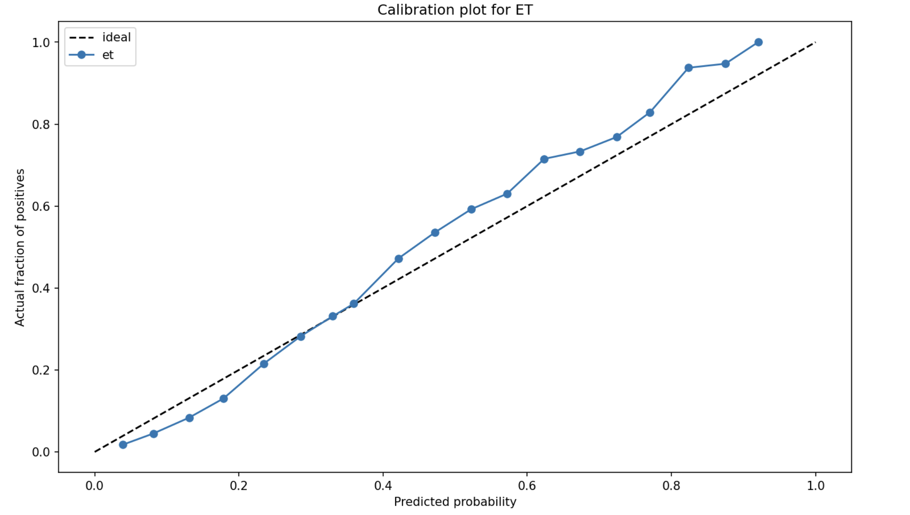
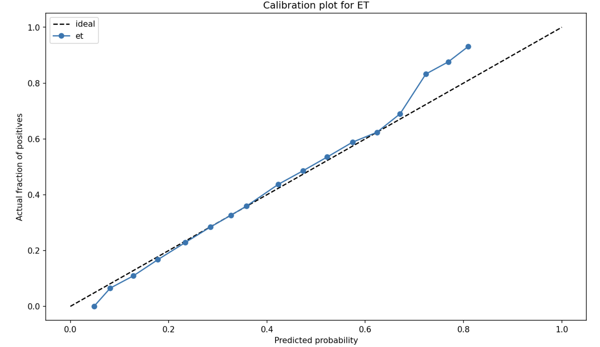

# Model Calibration

### Problem

[Calibration](https://youtu.be/ArOw6qZ_eZA?t=1426)

Насколько скор модели можно интерпретировать как вероятность?

Например, мы подбираем товары в интернет-магазине чтобы рекомендовать их пользователю. Мы показываем пользователю товары с **наибольшим скором** - это понятно с точки зрения ML. Но с точки зрения бизнеса товары имеют различные цены, поэтому оптимизировать хотелось бы матожидание профита - умножать скор модели на цену товара. Но в случае, если скор должен представлять собой именно вероятность покупки - “из коробки” скор Catboost (и других реализаций бустинга) таким свойством не обладает.

Говорят, что классификатор откалиброван если его скор представляет собой вероятность класса `1` , то есть среди объектов, у которых скор `0.8` к классу `1` будут принадлежат 80% элементов.

### Solutions

Для определения “откалиброванности” классификатора используют калибровочные кривые

- oX - скор классификатора (уверенность)
- oY - истинная доля (ground truth) позитивов среди всех объектов с таким скором

Откалиброванный классификатор дает прямую из (0, 0) в (1, 1). Чтобы меньше “шумело” считают по бинам (разбиваем объекты по квантилям и усредняем скор внутри каждого бина).

Калибровка модели заключается в обучении модели регрессии (калибратора), которая переводит скор неоткалиброванного классификатора в другое пространство, где этот скор лучше соответствует калибровочной кривой: для скора f_i  на объекте  калибратор возвращает значение вероятности p(y=1 | f_i).

Для избежания переобучения при настройке классификатора и калибратора нужно разделять обучающую выборку, иначе получим смещенный калибратор.

В Sklearn [реализовано](https://scikit-learn.org/stable/modules/calibration.html) два вида регрессоров

- Sigmoid - подходит для under-confident моделей, ошибка калибрации должна быть симметрична (не подходит для несбалансированных датасетов)
- [Isotonic](https://scikit-learn.org/stable/modules/isotonic.html#isotonic) - подходит для случаев, когда калибрующая функция должна быть монотонной

### Implementation

Далее примеры кода и немного графиков

Before calibration



Видно что ошибка модели довольно симметрична - under_confident переходит в over_confident примерно в районе отметки `0.4`

Для калибрации применяем сигмоиду. After Clibration



Результаты отличные - для численной оценки посчитал expected calibration error

Модель без калибровки: `0.00422`

Откалиброванная модель: `0.00142`

Непонятно только как тащить это в прод, получается что выход одной модели надо передавать на вход другой - это может усложнить архитектуру.

- Код для калибрации
    
    ```python
    import os
    
    import numpy as np
    from scipy.sparse import save_npz, load_npz
    from sklearn.preprocessing import OneHotEncoder
    from sklearn.linear_model import LogisticRegression
    from sklearn.metrics import roc_auc_scoreimport seaborn as sns
    
    def eval_roc_auc(input_df):
        return roc_auc_score(input_df['y'], input_df['y_hat'])
    
    def expected_calibration_error(preds_df):
        num_samples = preds_df.shape[0]
    
        errors_sum = (
            preds_df
            .sort_values(by='y_hat')
            .groupby('prob_bin')
            .aggregate({'y':  ['count', 'mean'], 'y_hat': 'mean'})
            .apply(lambda row: row[0] * np.abs(row[1] - row[2]), axis=1)
            .sum()
        )
    
        expected_calibration_error =  errors_sum / num_samples
        
        return expected_calibration_error
    
    # vanila model
    predictions = estimator.predict(train_data_df[feature_list], prediction_type = 'Probability')[:, 1]
    sns.histplot(predictions, stat='probability', bins=30)
    catboost_pred_df = pd.DataFrame({'y':  train_data_df['target'], 'y_hat': predictions})
    eval_roc_auc(catboost_pred_df)
    
    # Calibrated model
    leaves_encoded_matrix_path = 'data/leaves_encoded.npz'
    
    if os.path.exists(leaves_encoded_matrix_path):
        print('loading...')
        leaves_encoded = load_npz(leaves_encoded_matrix_path)
    else:
        print('evaluating...')
        encoder = OneHotEncoder()
        leaves_encoded = encoder.fit_transform(leaves_matrix)
        save_npz(leaves_encoded_matrix_path, leaves_encoded)
    print('leaves encoded')
    
    print('Calibrator train started...')
    lr = LogisticRegression(solver='sag', C=10**(-3), fit_intercept=False)
    lr.fit(leaves_encoded, train_data_df['target'])
    print('Train finished')
    
    lr_predictions = lr.predict_proba(leaves_encoded)[:,1]
    lr_pred_df = pd.DataFrame({'y':  train_data_df['target'], 'y_hat': lr_predictions})
    
    expected_calibration_error(lr_pred_df)
    expected_calibration_error(catboost_pred_df)
    ```
    

### Sources

[Блог Дьяконова: Проблема калибровки уверенности](https://alexanderdyakonov.wordpress.com/2020/03/27/%D0%BF%D1%80%D0%BE%D0%B1%D0%BB%D0%B5%D0%BC%D0%B0-%D0%BA%D0%B0%D0%BB%D0%B8%D0%B1%D1%80%D0%BE%D0%B2%D0%BA%D0%B8-%D1%83%D0%B2%D0%B5%D1%80%D0%B5%D0%BD%D0%BD%D0%BE%D1%81%D1%82%D0%B8/)

[Sklearn probas calibration](https://scikit-learn.org/stable/modules/calibration.html) , [tutorial](https://machinelearningmastery.com/calibrated-classification-model-in-scikit-learn/)

[Medium: classifier calibration](https://towardsdatascience.com/classifier-calibration-7d0be1e05452)

[[Youtube] CS Centre: calibration](https://youtu.be/ArOw6qZ_eZA?t=1421)

[[YouTube] Karpov Courses: calibration](https://www.youtube.com/live/IL7sWMOazXQ?feature=share)

[Model calibration](https://www.linkedin.com/feed/update/activity:7235319659518984192)

[calibration explained](https://www.linkedin.com/feed/update/activity:7266069842804289536)