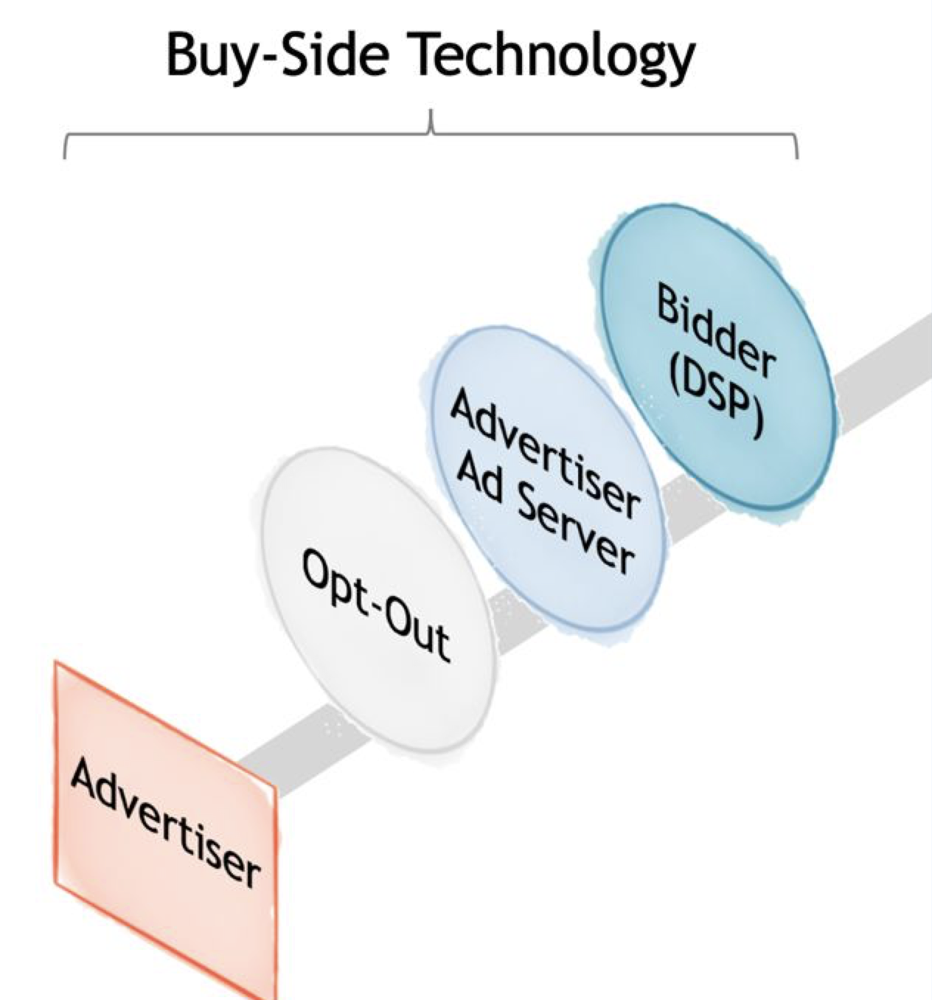

# RTB

### What is RTB (Real-Time Bidding)?

Real-Time Bidding is a method of buying and selling online ad impressions through real-time auctions that happen in milliseconds as a user loads a webpage or app.

- When a user visits a website or opens an app, the ad space is auctioned.
- Advertisers bid to show their ad to that specific user, based on data (location, interests, device, etc.).
- The highest bidder wins, and their ad is shown — all in the time it takes to load the page.

```text
[ Publisher's Website / App ]
           v
      [ SSP - Supply Side Platform ]
           v
     [ Ad Exchange / RTB Auction ]
           v
      [ DSP - Demand Side Platform ]
           v
     [ Advertisers / Brands ]
```

### What is an Ad Network?

An Ad Network is a platform that connects advertisers with publishers by aggregating ad inventory (from websites, mobile apps, etc.) and selling it in bundles.

Think of it as a middleman that:

- Collects unsold ad space from many publishers.
- Packages it based on categories (e.g. gaming, finance, lifestyle).
- Sells it to advertisers who want to reach certain audiences.

---

### Key Features of Ad Networks:

- Pre-negotiated deals: Ad placements are often bought in advance, not necessarily in real-time.
- Simplified integration: SDKs (like AdMob’s or Unity Ads') make it easy for mobile developers to monetize their apps.
- Less granular targeting compared to RTB/DSPs.
- Sometimes offer mediation tools to work with multiple ad sources.

---

### Ad Networks vs. RTB Platforms

| Feature | Ad Network (e.g., AdMob, Unity Ads) | RTB/Programmatic (e.g., SSP/DSP) |
| --- | --- | --- |
| Buying Method | Direct or fixed-price deals | Real-time auctions (bidding) |
| Flexibility | Limited targeting | Advanced targeting (behavioral, contextual) |
| Transparency | Less transparent | Highly transparent and dynamic |
| Integration for Publishers | SDK-based, quick setup | More technical, requires header bidding or tags |
| Best Use Case | Mobile monetization, small publishers | Large-scale campaigns, precise targeting |

In Real-Time Bidding (RTB), SSP stands for Supply-Side Platform.

### Here's what it does:

An SSP helps publishers (like websites or apps) manage, sell, and optimize their available ad inventory in real time.

### In simple terms:

- SSP = Seller's tool in RTB.
- It connects the publisher's inventory to ad exchanges and demand-side platforms (DSPs).
- It allows multiple advertisers to bid for the same ad space, maximizing revenue for the publisher.

### Key features:

- Manages inventory and pricing rules.
- Supports header bidding and private marketplaces.
- Sends bid requests to DSPs and receives bids back.
- Selects the highest bidder and serves the winning ad.

If DSP is the "buyer," SSP is the "seller" in the RTB ecosystem. Want a diagram or more examples?

## Bidder

In RTB, a bidder is a software component (or service) that evaluates ad opportunities (impressions) in real-time and decides how much to bid on behalf of an advertiser.

You can think of it as the "brains" inside a Demand-Side Platform (DSP) — or even as a standalone service integrated with a DSP or ad exchange.

---

### What Does a Bidder Do?

```text
[ User opens app/website ]
           v
[ SSP sends bid request ]
           v
[ Ad Exchange ]
           v
[ Bidder (inside DSP or separate) ]
           v
[ Evaluates & bids ]
           v
[ Highest bidder wins, ad is shown ]
```

1. Receives bid requests from SSPs/ad exchanges — including info like:
    - User location
    - Device type
    - Time of day
    - App or website
    - Past user behavior (if available)
2. Evaluates value of showing an ad to this user.
3. Calculates a bid price based on:
    - Targeting rules
    - Budget constraints
    - Expected return on investment (ROI)
4. Sends bid response back to the exchange.
5. If it wins, the ad is served to the user.

## What is Opt-Out?

- opt-out
    
    
    

"Opt-Out" refers to the mechanism by which a user can choose not to have their data used for targeted advertising.

Here's how it fits into the flow shown:

- Advertiser: The entity that wants to display ads.
- Opt-Out: This represents the user's choice to limit or prevent the collection and use of their data for personalized advertising.
- Advertiser Ad Server: This server likely stores the ad creatives and may be involved in serving the ads.
- Bidder (DSP - Demand-Side Platform): The technology used by advertisers to automatically bid on ad impressions in real-time.

## Ref

* [Ozon: сервис авто-бидов](https://habr.com/ru/companies/ozontech/articles/768102/)
* [Ozon Tech meetup](https://habr.com/ru/companies/ozontech/articles/750196/)
* [Evolution of Ads Conversion Optimization Models at Pinterest](https://medium.com/pinterest-engineering/evolution-of-ads-conversion-optimization-models-at-pinterest-84b244043d51)
* [Day 13 — Machine Learning System Design: Ads Recommendation System Design](https://medium.com/@jh.baek.sd/day-13-machine-learning-system-design-ads-recommendation-system-design-eabaa1dcc6ee)
* [ML Party Москва — 14 марта 2024](https://www.youtube.com/watch?v=0ZU-FtLO4Fw&t=433s)
* [Как устроены механизмы CPA продвижения на поиске Маркета](https://youtu.be/xvBK6MQqrP0?si=cY1099oIYI5Rdg1V)