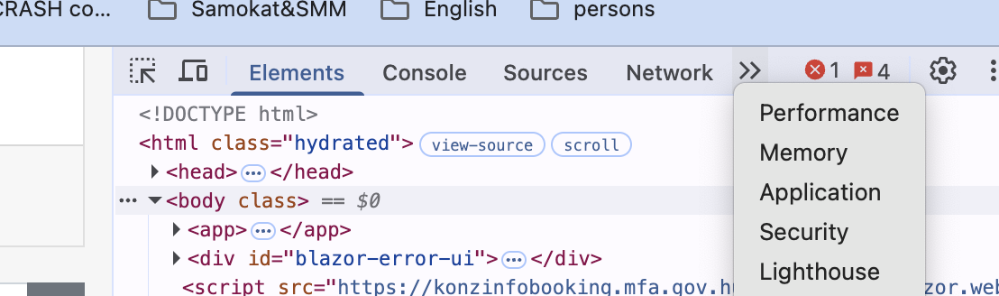
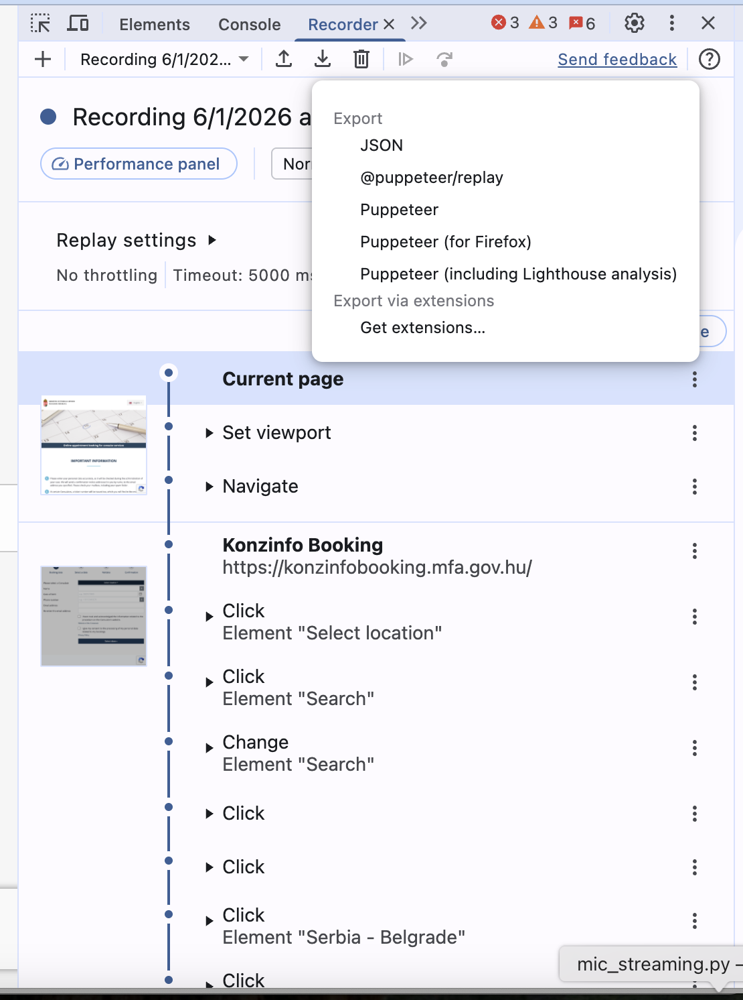

# Browser automation

LLM-powered clicker

Tl/DR: for creating clicker script with coding agent look at [meta_prompt](./scraping_data_browser_automation_creation_skill.md)

* Open page in browser
* Run screen recodrind (use QuickTime if you under macOS)
* Run Chrome's built-in recorder (DevTools → Recorder tab). 



* Push 'Record' button, then start doing actions, if all done - stop recording and export records (clicks, inputs, form fills) in both formats - `JSON` and `@puppeter/replay` as a replayable script



* stop screen recording
* save page as `.mhtml`: File -> Save page as -> full page (single file)


Notes
* convert screen recording video from `.mov` to `.mp4` if you are under MacOS `ffmpeg -i demo.mov -c:v libx264 -crf 28 -c:a aac -b:a 96k demo.mp4`
* instruct agent to ro a screenshots if to confirm logs with rendered page

```shell
ffmpeg -ss 00:01:30 -i input.mp4 -vframes 1 output.jpg
``


# Data scraping

LLM-powered scraping pipeline

* save page as `.mhtml`
* do a screenshot of what item you want to scrape
* ask agent to build BeautifulSoup scraper: add a little context, gie access to `.mhtml` and screenshoot

```python
def extract_links(item_card_scraper):
    reviews = []
    for block_num, r in enumerate(item_card_scraper.find_all(class_='wp-block-tc23-post-picker')):
        classes = {f'class_{i}': j for i, j in enumerate(r['class'])}
        for link in r.find_all('a'):
            item_link = link.get('href')
            res = {
                'block_num': block_num,
                'link': item_link,
                'preview': re.sub(r'\s+', ' ', link.text).strip()
            }
            res.update(classes)
            res.update(get_attrs_from_link(item_link))
            reviews.append(res)
    news_df = pd.DataFrame(reviews)
    return news_df

html_content = read_html(feed_pages_dir, scraped_pages_list[0])
item_card_scraper = BeautifulSoup(
    markup=html_content, features="html.parser"
)
extract_links(item_card_scraper)
```

# Refs

* [Crawl4AI](https://github.com/unclecode/crawl4ai)
* [HTML to markdown](https://www.linkedin.com/feed/update/ugcPost:7239606190995886082)
* [Web scraping will never be the same: Crawl4AI](https://www.linkedin.com/posts/akshay-pachaar_web-scraping-will-never-be-the-same-crawl4ai-activity-7313538911065018368-B2-J)
* [Pydantic AI Web Scraper: Llama 3.3 Python Powerful AI Research Agent](https://pub.towardsai.net/pydantic-ai-web-scraper-llama-3-3-python-powerful-ai-research-agent-6d634a9565fe)
* [Scraperr](https://github.com/jaypyles/Scraperr)
* [scraping Medium with python](https://dorianlazar.medium.com/scraping-medium-with-python-beautiful-soup-3314f898bbf5)