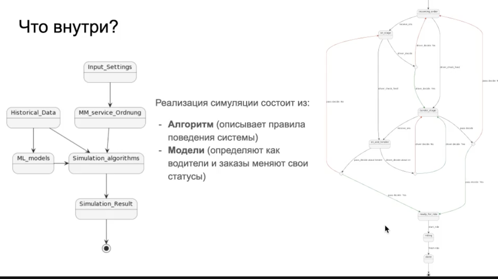

# Simulation modeling

[Sim4Rec (Sberbank)](https://developers.sber.ru/portal/products/sim4rec) - продукт для измерения отклика

Симуляция - процесс пошагового исполнения действий в среде и получения ответов от среды на каждом шаге

Количество шагов в симуляции является временем симуляции

```python
def simulate(self):
    while self.current_time < self.finish_time:
        self.make_simulation_step()
        self.current_time += self.timestep

def make_simulation_step(self):
    self.balance_num_of_drivers()
    self.create_new_orders()
    self.cancel_orders()
    self.receive_sns()
    self.drivers_make_decision()
    self.drivers_check_feed()
    self.pass_make_decision()
    self.starting_ride()
    self.driver_decide_to_roam()
    self.move_drivers()
```

Внутри симуляции модели (описывают разные сущности) и алгоритм перехода  взаимодействия моделей, который обеспечивает переходы между состояниями системы



Логи симуляции - для отладки полезно визуализировать

This is log output, not code. Here's the extracted text:

```
test_log:Order 3687035001 status changed from "incoming" to "canceled"
test_log:Order 3687035001 removed
test_log:Order 3687035214 status changed from "_sn+tender" to "canceled"
test_log:Driver 32931508.0 status changed to free
test_log:Driver 110574873.0 status changed to free
test_log:Driver 32931508.0 status changed to free
test_log:Order 3687035214 removed
test_log:cancel_orders - DONE
test_log:receive_sns - Start
test_log:received pairs: [[3687036857, [44845285.0, 65434708.0]], [3687036212, [6784993.0]]]
test_log:Driver 44845285.0 status changed to receive_sn
test_log:Driver 44845285.0 got sn about order 3687036857
test_log:Order 3687036857 status changed from "incoming" to "sn_send"
test_log:Driver 65434708.0 status changed to receive_sn
test_log:Driver 65434708.0 got sn about order 3687036857
test_log:Order 3687036857 status is already sn_send
test_log:Driver 6784993.0 status changed to receive_sn
test_log:Driver 6784993.0 got sn about order 3687036212
test_log:Order 3687036212 status changed from "incoming" to "sn_send"
test_log:receive_sns - DONE
test_log:driver_decide - Start
test_log:Driver 5345941.0 decision about order 3687035393 is: driver_decline
test_log:Driver 5345941.0 status changed to free
test_log:Driver 63748688.0 decision about order 3687035786 is: driver_accept
test_log:Order 3687035786 status changed from "sn_send" to "_sn+tender"
```

[Practical computer simulations for product analysts](https://towardsdatascience.com/practical-computer-simulations-for-product-analysts-fe61e2b577f5)