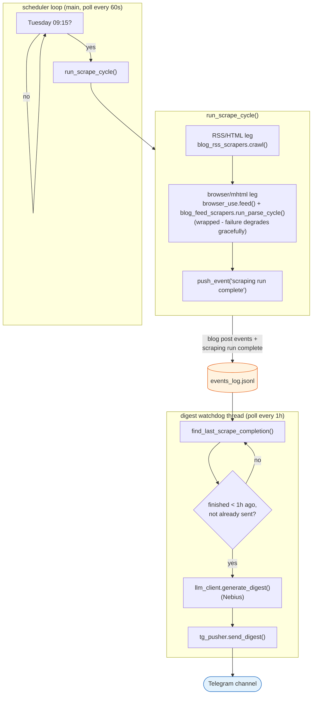
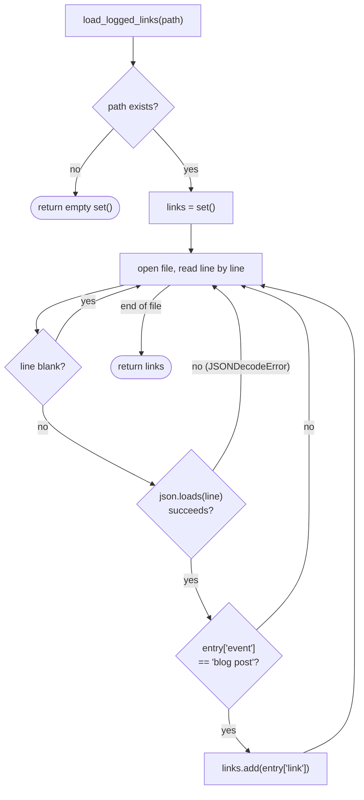
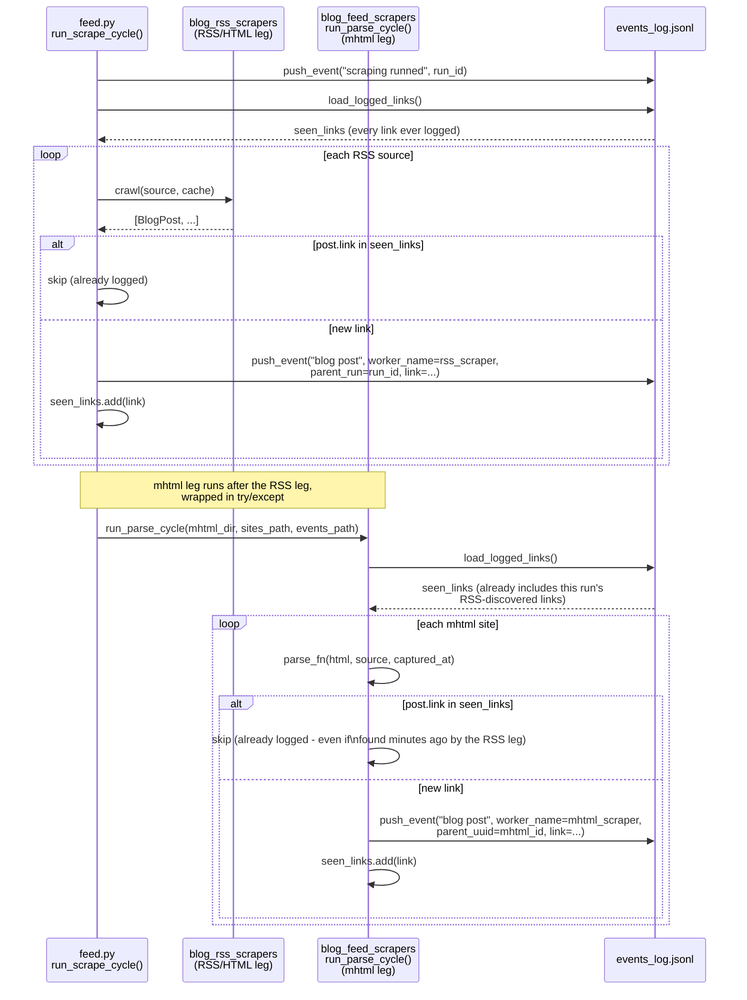
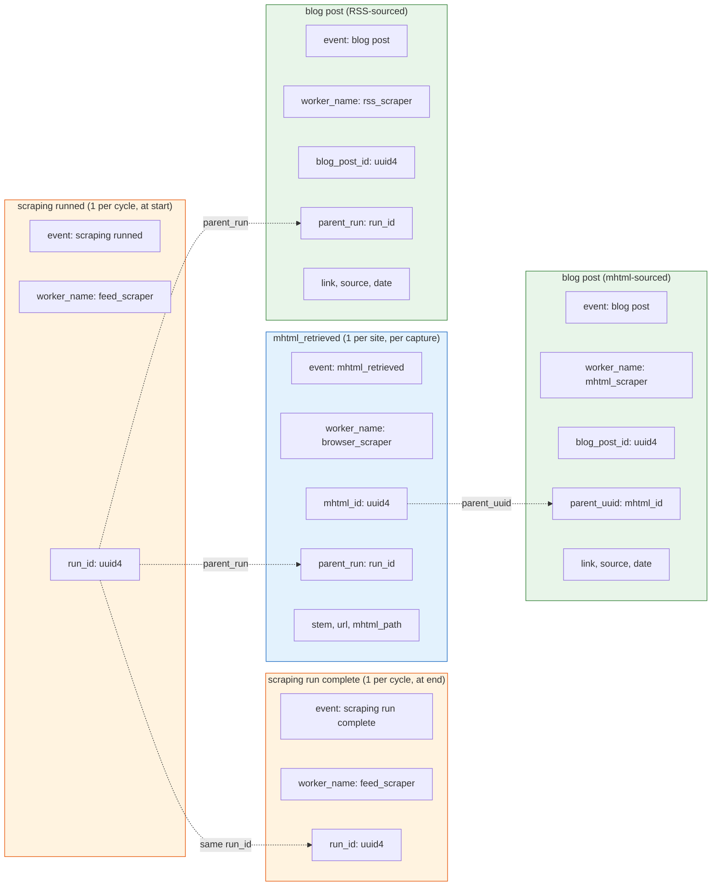
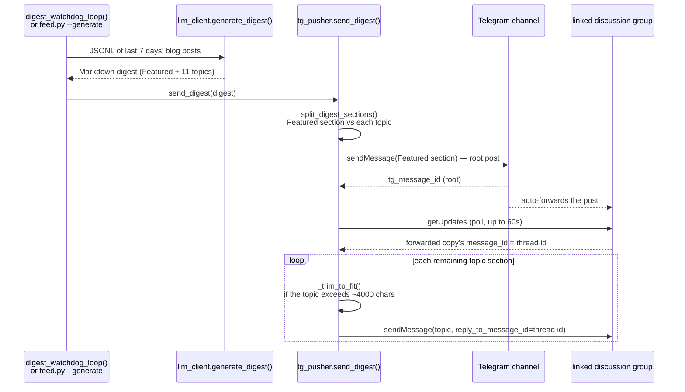

# How blog posts get deduplicated: `load_logged_links()`

## Product overview

This pipeline crawls **118 RSS/HTML sources** (`blog_sources.jsonl`) and **9 JS-rendered blogs** (`browser_sites.jsonl`) once a week (`feed.py`, Tuesday 09:15 local time), logs every distinct post it finds exactly once, forever, and **automatically** turns the last 7 days of that log into a topic-organized digest posted to Telegram — no manual step required. Delivery is handled by a background thread (`digest_watchdog_loop`, see "System architecture" below) that checks hourly for a scrape cycle having just finished and, within about an hour of it completing, generates the digest via Nebius and pushes it to the channel. As of this writing, the log (`data/events_log.jsonl`) holds:

| | count |
|---|---|
| unique blogposts ever logged | 7,186 |
| — via the RSS/HTML leg | 6,772 |
| — via the browser/mhtml leg | 414 |
| mhtml snapshots captured | 18 |
| scrape cycles started | 3 |
| Telegram messages sent | 12 |

**Two independent legs feed the same log:**

| | RSS/HTML leg | Browser/mhtml leg |
|---|---|---|
| sources | 118, in `blog_sources.jsonl` | 9, in `browser_sites.jsonl` |
| driven by | `blog_rss_scrapers.py` | `browser_use.py` + `blog_feed_scrapers.py` |
| strategy | RSS/Atom feed if one exists (`discover_feed()`), else scrape the index page for article links and open each one for its date (`from_html()`) | headless CloakBrowser captures a full `.mhtml` snapshot of the index page; a per-site BeautifulSoup parser (`PARSERS` dict) extracts posts from the saved HTML |
| why it exists | most blogs have a working feed or server-rendered HTML - cheap, no browser needed | a handful of sites (Unsloth, Anyscale, Lightning AI, Databricks, Pinecone, ...) render their post list client-side in JS; a plain HTTP GET returns an near-empty shell, so only a real browser sees the content (verified directly - e.g. Uber's article pages are a byte-identical empty shell regardless of URL) |
| `worker_name` on `"blog post"` events | `rss_scraper` | `mhtml_scraper` |
| traceable back to | `parent_run` (the `"scraping runned"` event for that cycle) | `parent_uuid` (the `"mhtml_retrieved"` event for that capture) |

Both legs call `load_logged_links()` (below) before pushing anything, so a link discovered by one leg can never be re-logged by the other - see "Where it's called" for how that holds even within one combined cycle. Sources vary a lot in how much history they expose through this pipeline in one pass - most contribute a handful of recent posts, but a large Atom feed like Shopify Engineering's serves its entire archive (428 items) in one fetch, which is why the log's oldest dated post is from 2010, not last week.

## System architecture

`feed.py` runs two independent, concurrently-running loops, on two different
clocks, connected only through `events_log.jsonl` - neither calls the other
directly:

1. **The scheduler loop** (`main()`'s own `while True`), polling every
   `TRIGGER_POLL_SECONDS` (60s) for the weekly trigger (Tuesday, `TARGET_HOUR:TARGET_MINUTE`
   = 09:15). When it fires, it runs `run_scrape_cycle()` - both scraping legs,
   end to end - and pushes `"scraping run complete"` once both are done.
2. **The digest watchdog** (`digest_watchdog_loop()`, a daemon thread started
   right before the scheduler loop begins), polling every hour. Each wake-up
   it looks for the most recent `"scraping run complete"` event; if one
   finished within the last hour and hasn't already been sent, it generates
   the digest (Nebius, via `llm_client.py`) and pushes it to Telegram
   (`tg_pusher.py`) - the same code path `feed.py --generate` runs by hand.

Decoupling delivery from the trigger this way means a scrape kicked off with
`--force`, or one that runs unusually long, still gets its digest sent
automatically - the watchdog doesn't care *why* a cycle finished, only *that*
it did, recently.



The two loops' cadences are deliberately different and don't need to line up:
the scheduler checks every minute so it can land on an exact `HH:MM`, while
the watchdog only needs to notice a completion sometime within the hour after
it happens - checking every minute for that would just be wasted polling.
Worst case, a digest goes out just under an hour after the scrape that
produced it; in practice (see the timing example below) it's usually much
sooner, since the watchdog's hourly clock runs independently of the
scheduler's.

**Timing example** (an actual run): the process started at 09:08, so the
watchdog's clock ticks at 10:08, 11:08, .... The 09:15 scheduled scrape
finished at 09:29. The watchdog's *first* tick after that, at 10:08, found a
completion only 39 minutes old and sent the digest immediately - had the
scrape instead finished at, say, 09:35 (six minutes into that same hour-long
wait), the watchdog would still have caught it at 10:08, just with a shorter
39-minute gap between "finished" and "noticed."

## Environment setup

This directory's scripts (`feed.py`, `blog_rss_scrapers.py`, `blog_feed_scrapers.py`,
`browser_use.py`, `metrics.py`) share one local virtual environment, kept
separate from the rest of the repo so `make run-detach`/`make deploy` are
self-contained. Create it with [uv](https://github.com/astral-sh/uv):

```
cd src/scraping
uv venv
uv pip install --python .venv/bin/python -r requirements.txt
```

`requirements.txt` lists only the direct dependencies (`beautifulsoup4`,
`requests`, `feedparser`, `python-dateutil`, `cloakbrowser`,
`opentelemetry-sdk`, `opentelemetry-exporter-otlp-proto-http`) - transitive
packages (`urllib3`, `playwright`, `httpx`, etc.) resolve automatically.
`.venv/bin/python` is what the `Makefile`'s `PYTHON` variable points at by
default, so `make run-force`/`make run-detach` use this same environment.

This explains one function — `utils.load_logged_links()` — and the design
decision behind it: **`data/events_log.jsonl` is the single, permanent
record of every blogpost link this project has ever discovered.** No post
link is ever logged twice, no matter which pipeline (RSS or browser/mhtml)
finds it, or how many times a cycle re-scrapes a page that still lists it.

There used to be a second output, `data/blogposts.jsonl` — a full snapshot
of "every post visible right now," rewritten on every run. It was dropped:
nothing consumed its one point of difference from the events log (that it
also lists a post that's still live today, and drops one that scrolled off
an index page), so it was pure duplicated state. `events_log.jsonl` is now
the only place this data lives.

## The function

`load_logged_links()` lives in `utils.py`. It does one thing: read the whole
events log line by line, and return the set of every `link` that has ever
appeared on a `"blog post"` event. That's it — no timestamps, no ordering,
no per-source grouping, and if the file doesn't exist yet it just returns an
empty set rather than erroring.

Two defensive details in how it reads the file:

- A blank line is skipped rather than handed to the JSON parser.
- A line that fails to parse is skipped rather than crashing the caller —
  one torn/corrupt line (e.g. from a process killed mid-write) shouldn't
  take down an entire scrape cycle.

`events_log.jsonl` holds more than one kind of row (`"scraping runned"`,
`"scraping run complete"`, `"mhtml_retrieved"`, `"blog post"`,
`"tg_message_sent"` — see the schema diagram below), so checking each row's
`event` field for `"blog post"` is what tells this function which rows even
have a meaningful `link` to collect in the first place.

## Algorithm



## Where it's called: dedup across two independent pipelines

The interesting part isn't the function itself — it's that **both**
scraping pipelines call it, at the start of their own cycle, before pushing
any `"blog post"` events of their own. That's what makes the uniqueness
guarantee hold *across* pipelines, not just within one.



Two things worth noticing in that sequence:

1. **The RSS leg's `seen_links` set is extended in memory** as it pushes new
   events, so two sources in the *same* RSS run that happen to list the same
   link (rare, but possible — e.g. a cross-post) only produce one event, not
   two. `run_parse_cycle()` does the same for the mhtml leg.
2. **The mhtml leg calls `load_logged_links()` again, fresh, after the RSS
   leg has already finished.** It doesn't reuse the RSS leg's in-memory set.
   That re-read is what lets a post discovered by the RSS feed *this same
   cycle* correctly suppress a duplicate `"blog post"` event when the mhtml
   parser finds the same URL on a site's index page a few seconds later.

## Why filter on `"blog post"` specifically: the event schema

`load_logged_links()` only cares about one of five event shapes that share
this file. The other four exist to make each `"blog post"` event traceable
back to *why* it was logged, or to mark cycle-level bookkeeping (a cycle
starting, a cycle finishing, a digest message going out) - not to describe a
post themselves - that's why they're excluded from the link set entirely.



`load_logged_links()` collects `link` only from the two green boxes
(`"blog post"`, regardless of `worker_name`) — the orange (`"scraping
runned"`/`"scraping run complete"`) and blue (`"mhtml_retrieved"`) boxes
carry `run_id`/`mhtml_id` values that make a `"blog post"` event traceable to
its origin, but none of them has a `link` field itself, so the
`entry.get("event") == "blog post"` check correctly leaves them out of the
set. `"scraping run complete"` is the newest of these bookkeeping events -
it's not consumed by `load_logged_links()` at all, but by
`find_last_scrape_completion()` (see "System architecture" above), which the
digest watchdog polls to know when a cycle has just finished. A sixth event
shape, `"tg_message_sent"` (one per Telegram message, root or comment - see
"Automatic digest delivery" below), rounds out the schema but isn't pictured
here since it isn't part of the `run_id`/`mhtml_id` lineage this diagram is
about.

## Net effect

Query `events_log.jsonl` for `event == "blog post"`, dedupe by `link` (which
is already guaranteed by construction — this is exactly the set
`load_logged_links()` builds), and you have the full, current, permanent
list of every distinct blogpost this project has ever discovered, from
either pipeline, with no separate snapshot file required.

## Automatic digest delivery: the watchdog + `tg_pusher.py`

Building the digest (`llm_client.generate_digest()` — the last 7 days of
`"blog post"` events, organized by topic with a Featured — Editor's Choice
highlight reel up top) and handing the raw Markdown to
`tg_pusher.send_digest()`, which posts it as a **channel post followed by a
comment thread** (not one giant message — Telegram caps a single message at
~4096 characters, and a full digest is far longer than that), is the same
code whether it runs automatically or by hand:

### Two triggers, one code path

| | automatic | manual |
|---|---|---|
| entry point | `digest_watchdog_loop()`, a daemon thread `main()` starts alongside the scheduler loop | `feed.py --generate` |
| runs when | every hour, if the last `"scraping run complete"` finished <1h ago and hasn't been sent yet (`last_sent_run_id` guards against re-sending the same run on a later tick) | whenever someone runs the command |
| scope of "last 7 days" | same `load_recent_blog_posts(events_path, days=7)` either way | same |

A real example from this log: the watchdog's check at `10:08:34` found a
scrape that had completed at `09:29:49` (39 minutes earlier), generated the
digest, and by `10:14:55` had posted all 12 messages (1 root + 11 topic
comments) — `digest watchdog: sent digest to Telegram as 12 message(s):
[69, 108, 109, ..., 118]`.

### Why comments, not replies

`CHANNEL_ID` (e.g. `@test_blogposts_miner`) is a genuine Telegram
**channel**, and channels don't support replying to their own posts at all.
What looks like a "comment thread" under a channel post is a completely
separate chat under the hood: every channel can have a **linked discussion
group**, and Telegram auto-forwards each channel post into that group as a
plain message. A real comment is a normal reply *in the discussion group*,
targeting that forwarded copy's `message_id` — the channel post's own id
means nothing there. There is no "get the thread for this post" API call,
so `wait_for_discussion_thread()` polls `getUpdates` until the forward shows
up (observed 3–20s in testing; 60s default timeout).



If the channel has no linked discussion group, or the forward doesn't show
up within `thread_wait_timeout`, `send_digest()` degrades gracefully:
it posts every remaining topic as an independent channel message instead of
a comment, rather than dropping content silently.

### Every send is an event, too

Every message sent — root or comment — is logged as its own
`"tg_message_sent"` event, real examples from this log:

```json
{"event": "tg_message_sent", "worker_name": "tg_pusher", "tg_message_id": 71,
 "chat_id": "@test_blogposts_miner", "text": "<b>Featured — Editor's Choice</b>..."}
{"event": "tg_message_sent", "worker_name": "tg_pusher", "tg_message_id": 82,
 "chat_id": -1003920594269, "reply_to_message_id": 71, "text": "<b>11. Practice...</b>..."}
```

`reply_to_message_id` is present only on comments, never on the root message
— that's how a reader of the log can tell which message started a thread,
the same `parent_run`/`parent_uuid` pattern `"blog post"` events already use
to trace back to *their* origin.

### Markdown → Telegram HTML

`parse_mode=HTML` only supports a handful of tags (`<b>`, `<i>`, `<a>`,
`<code>` — no headings, no lists). `markdown_to_telegram_html()` is a
line-level converter, not a generic Markdown renderer: `#`/`##` headings
become bold lines, `- ` bullets become `• `, and `inline_md_to_html()`
handles `**bold**`, `*italic*`, `[text](url)`, and `` `code` `` within each
line — bold is substituted before italic since both use a literal `*`, so a
`**bold**` marker's asterisks are gone (turned into `<b>`) before the
italic pass ever sees them.
